{width="8.498938101487314in" height="9.625in"}**MATLAB® Coder™**

>> **快速入门指南**
>>

>> **如何联系 MathWorks**
>>

{width="0.4533333333333333in" height="0.275in"} 最新动态： [**www.mathworks.com**](https://www.mathworks.com/)

销售和服务： [**www.mathworks.com/sales_and_services**](https://www.mathworks.com/sales_and_services)

用户社区： [**www.mathworks.com/matlabcentral**](https://www.mathworks.com/matlabcentral)

技术支持： [**www.mathworks.com/support/contact_us**](https://www.mathworks.com/support/contact_us)

{width="0.26166666666666666in" height="0.17666666666666667in"} 电话： 010-59827000

{width="0.25in" height="0.17166666666666666in"}迈斯沃克软件 (北京) 有限公司

北京市朝阳区望京东园四区 6 号楼

北望金辉大厦 16 层 1604

MATLAB® Coder™ 快速入门指南

© COPYRIGHT 2011--2022 by The MathWorks, Inc.

The software described in this document is furnished under a license agreement. The software may be used or copied only under the terms of the license agreement. No part of this manual may be photocopied or reproduced in any form without prior written consent from The MathWorks, Inc.

FEDERAL ACQUISITION: This provision applies to all acquisitions of the Program and Documentation by, for, or through the federal government of the United States. By accepting delivery of the Program or Documentation, the government hereby agrees that this software or documentation qualifies as commercial computer software or commercial computer software documentation as such terms are used or defined in FAR 12.212, DFARS Part 227.72, and DFARS 252.227-7014. Accordingly, the terms and conditions of this Agreement and only those rights specified in this Agreement, shall pertain to and govern the use, modification, reproduction, release, performance, display, and disclosure of the Program and Documentation by the federal government (or other entity acquiring for or through the federal government) and shall supersede any conflicting contractual terms or conditions. If this License fails to meet the government\'s needs or is inconsistent in any respect with federal procurement law, the government agrees to return the Program and Documentation, unused, to The MathWorks, Inc.

>> **商标**
>>

MATLAB and Simulink are registered trademarks of The MathWorks, Inc. See **[www.mathworks.com/trademarks](https://www.mathworks.com/trademarks)** for a list of additional trademarks. Other product or brand names may be trademarks or registered trademarks of their respective holders.

>> **专利**
>>

MathWorks products are protected by one or more U.S. patents. Please see [**www.mathworks.com/patents**](https://www.mathworks.com/patents)

for more information.

+--------------------+------------------+---------------------------------------------+
| >> **修订历史记录** |                  |                                             |
+====================+==================+=============================================+
| > 2011 年 4 月     | > 仅限在线版本   | > R2011a 中的新增内容                       |
+--------------------+------------------+---------------------------------------------+
| > 2011 年 9 月     | > 仅限在线版本   | > 版本 2.1（版本 2011b）中的修订内容        |
+--------------------+------------------+---------------------------------------------+
| > 2012 年 3 月     | > 仅限在线版本   | > 版本 2.2（版本 2012a）中的修订内容        |
+--------------------+------------------+---------------------------------------------+
| > 2012 年 9 月     | > 仅限在线版本   | > 版本 2.3（版本 2012b）中的修订内容        |
+--------------------+------------------+---------------------------------------------+
| > 2013 年 3 月     | > 仅限在线版本   | > 版本 2.4（版本 2013a）中的修订内容        |
+--------------------+------------------+---------------------------------------------+
| > 2013 年 9 月     | > 仅限在线版本   | > 版本 2.5（版本 2013b）中的修订内容        |
+--------------------+------------------+---------------------------------------------+
| > 2014 年 3 月     | > 仅限在线版本   | > 版本 2.6（版本 2014a）中的修订内容        |
+--------------------+------------------+---------------------------------------------+
| > 2014 年 10 月    | > 仅限在线版本   | > 版本 2.7（版本 2014b）中的修订内容        |
+--------------------+------------------+---------------------------------------------+
| > 2015 年 3 月     | > 仅限在线版本   | > 版本 2.8（版本 2015a）中的修订内容        |
+--------------------+------------------+---------------------------------------------+
| > 2015 年 9 月     | > 仅限在线版本   | > 版本 3.0（版本 2015b）中的修订内容        |
+--------------------+------------------+---------------------------------------------+
| > 2015 年 10 月    | > 仅限在线版本   | > 版本 2.8.1（版本 2015aSP1）中的再发布内容 |
+--------------------+------------------+---------------------------------------------+
| > 2016 年 3 月     | > 仅限在线版本   | > 版本 3.1（版本 2016a）中的修订内容        |
+--------------------+------------------+---------------------------------------------+
| > 2016 年 9 月     | > 仅限在线版本   | > 版本 3.2（版本 2016b）中的修订内容        |
+--------------------+------------------+---------------------------------------------+
| > 2017 年 3 月     | > 仅限在线版本   | > 版本 3.3（版本 2017a）中的修订内容        |
+--------------------+------------------+---------------------------------------------+
| > 2017 年 9 月     | > 仅限在线版本   | > 版本 3.4（版本 2017b）中的修订内容        |
+--------------------+------------------+---------------------------------------------+
| > 2018 年 3 月     | > 仅限在线版本   | > 版本 4.0（版本 2018a）中的修订内容        |
+--------------------+------------------+---------------------------------------------+
| > 2018 年 9 月     | > 仅限在线版本   | > 版本 4.1（版本 2018b）中的修订内容        |
+--------------------+------------------+---------------------------------------------+
| > 2019 年 3 月     | > 仅限在线版本   | > 版本 4.2（版本 2019a）中的修订内容        |
+--------------------+------------------+---------------------------------------------+
| > 2019 年 9 月     | > 仅限在线版本   | > 版本 4.3（版本 2019b）中的修订内容        |
+--------------------+------------------+---------------------------------------------+
| > 2020 年 3 月     | > 仅限在线版本   | > 版本 5.0（版本 2020a）中的修订内容        |
+--------------------+------------------+---------------------------------------------+
| > 2020 年 9 月     | > 仅限在线版本   | > 版本 5.1（版本 2020b）中的修订内容        |
+--------------------+------------------+---------------------------------------------+
| > 2021 年 3 月     | > 仅限在线版本   | > 版本 5.2（版本 2021a）中的修订内容        |
+--------------------+------------------+---------------------------------------------+
| > 2021 年 9 月     | > 仅限在线版本   | > 版本 5.3（版本 2021b）中的修订内容        |
+--------------------+------------------+---------------------------------------------+
| > 2022 年 3 月     | > 仅限在线版本   | > 版本 5.4 (R2022a) 中的修订内容            |
+--------------------+------------------+---------------------------------------------+
| > 2022 年 9 月     | > 仅限在线版本   | > 版本 5.5（版本 2022b）中的修订内容        |
+--------------------+------------------+---------------------------------------------+

## 查看 Bug 报告以确定并解决问题

Software is inherently complex and is not free of errors. The output of a code generator might contain bugs, some of which are not detected by a compiler. MathWorks reports critical known bugs brought to its attention on its Bug Report system at [www.mathworks.com/support/](https://www.mathworks.com/support/bugreports/) [bugreports/](https://www.mathworks.com/support/bugreports/). In the search bar, type the phrase \"Incorrect Code Generation\" to obtain a report of known bugs that produce code that might compile and execute, but still produce wrong answers. To save a search, click Save Search.

The bug reports are an integral part of the documentation for each release. Examine periodically all bug reports for a release, as such reports may identify inconsistencies between the actual behavior of a release you are using and the behavior described in this documentation.

In addition to reviewing bug reports, you should implement a verification and validation strategy to identify potential bugs in your design, code, and tools.

### [产品概述](#%E4%BA%A7%E5%93%81%E6%A6%82%E8%BF%B0-1)

[**1**](#%E4%BA%A7%E5%93%81%E6%A6%82%E8%BF%B0-1)

[MATLAB Coder 产品描述](#matlab-coder-%E4%BA%A7%E5%93%81%E6%8F%8F%E8%BF%B0) [1-2](#matlab-coder-%E4%BA%A7%E5%93%81%E6%8F%8F%E8%BF%B0)

[关于 MATLAB Coder](#%E5%85%B3%E4%BA%8E-matlab-coder) [1-3](#%E5%85%B3%E4%BA%8E-matlab-coder)

[何时使用 MATLAB Coder](#%E4%BD%95%E6%97%B6%E4%BD%BF%E7%94%A8-matlab-coder) [**1-3**](#%E4%BD%95%E6%97%B6%E4%BD%BF%E7%94%A8-matlab-coder)

[使用工程界面可以做什么](#%E4%BD%BF%E7%94%A8%E5%B7%A5%E7%A8%8B%E7%95%8C%E9%9D%A2%E5%8F%AF%E4%BB%A5%E5%81%9A%E4%BB%80%E4%B9%88) [**1-3**](#%E4%BD%BF%E7%94%A8%E5%B7%A5%E7%A8%8B%E7%95%8C%E9%9D%A2%E5%8F%AF%E4%BB%A5%E5%81%9A%E4%BB%80%E4%B9%88)

[何时使用命令行（codegen 函数）](#%E4%BD%95%E6%97%B6%E4%BD%BF%E7%94%A8%E5%91%BD%E4%BB%A4%E8%A1%8Ccodegen-%E5%87%BD%E6%95%B0) [**1-3**](#%E4%BD%95%E6%97%B6%E4%BD%BF%E7%94%A8%E5%91%BD%E4%BB%A4%E8%A1%8Ccodegen-%E5%87%BD%E6%95%B0)

[嵌入式软件应用程序的代码生成](#%E5%B5%8C%E5%85%A5%E5%BC%8F%E8%BD%AF%E4%BB%B6%E5%BA%94%E7%94%A8%E7%A8%8B%E5%BA%8F%E7%9A%84%E4%BB%A3%E7%A0%81%E7%94%9F%E6%88%90) [1-4](#%E5%B5%8C%E5%85%A5%E5%BC%8F%E8%BD%AF%E4%BB%B6%E5%BA%94%E7%94%A8%E7%A8%8B%E5%BA%8F%E7%9A%84%E4%BB%A3%E7%A0%81%E7%94%9F%E6%88%90)

[定点算法的代码生成](#%E5%AE%9A%E7%82%B9%E7%AE%97%E6%B3%95%E7%9A%84%E4%BB%A3%E7%A0%81%E7%94%9F%E6%88%90) [1-5](#%E5%AE%9A%E7%82%B9%E7%AE%97%E6%B3%95%E7%9A%84%E4%BB%A3%E7%A0%81%E7%94%9F%E6%88%90)

[安装必备产品](#%E5%AE%89%E8%A3%85%E5%BF%85%E5%A4%87%E4%BA%A7%E5%93%81) [1-6](#%E5%AE%89%E8%A3%85%E5%BF%85%E5%A4%87%E4%BA%A7%E5%93%81)

[相关产品](#%E7%9B%B8%E5%85%B3%E4%BA%A7%E5%93%81) [1-7](#%E7%9B%B8%E5%85%B3%E4%BA%A7%E5%93%81)

[设置 C 或 C++ 编译器](#%E8%AE%BE%E7%BD%AE-c-%E6%88%96-c-%E7%BC%96%E8%AF%91%E5%99%A8) [1-8](#%E8%AE%BE%E7%BD%AE-c-%E6%88%96-c-%E7%BC%96%E8%AF%91%E5%99%A8)

[期望背景](#%E6%9C%9F%E6%9C%9B%E8%83%8C%E6%99%AF) [1-9](#%E6%9C%9F%E6%9C%9B%E8%83%8C%E6%99%AF)

[代码生成工作流](#%E4%BB%A3%E7%A0%81%E7%94%9F%E6%88%90%E5%B7%A5%E4%BD%9C%E6%B5%81) [1-10](#%E4%BB%A3%E7%A0%81%E7%94%9F%E6%88%90%E5%B7%A5%E4%BD%9C%E6%B5%81)

[另请参阅](#%E5%8F%A6%E8%AF%B7%E5%8F%82%E9%98%85-2) [1-10](#%E5%8F%A6%E8%AF%B7%E5%8F%82%E9%98%85-2)

[代码生成的输入类型设定](#%E4%BB%A3%E7%A0%81%E7%94%9F%E6%88%90%E7%9A%84%E8%BE%93%E5%85%A5%E7%B1%BB%E5%9E%8B%E8%AE%BE%E5%AE%9A) [1-11](#%E4%BB%A3%E7%A0%81%E7%94%9F%E6%88%90%E7%9A%84%E8%BE%93%E5%85%A5%E7%B1%BB%E5%9E%8B%E8%AE%BE%E5%AE%9A)

[生成代码和 MATLAB 代码的形式差异](#%E7%94%9F%E6%88%90%E4%BB%A3%E7%A0%81%E5%92%8C-matlab-%E4%BB%A3%E7%A0%81%E7%9A%84%E5%BD%A2%E5%BC%8F%E5%B7%AE%E5%BC%82) [1-13](#%E7%94%9F%E6%88%90%E4%BB%A3%E7%A0%81%E5%92%8C-matlab-%E4%BB%A3%E7%A0%81%E7%9A%84%E5%BD%A2%E5%BC%8F%E5%B7%AE%E5%BC%82)

[将 MATLAB 函数映射到 C/C++ 函数](#%E5%B0%86-matlab-%E5%87%BD%E6%95%B0%E6%98%A0%E5%B0%84%E5%88%B0-cc-%E5%87%BD%E6%95%B0) [**1-13**](#%E5%B0%86-matlab-%E5%87%BD%E6%95%B0%E6%98%A0%E5%B0%84%E5%88%B0-cc-%E5%87%BD%E6%95%B0)

[函数输出的表示形式](#%E5%87%BD%E6%95%B0%E8%BE%93%E5%87%BA%E7%9A%84%E8%A1%A8%E7%A4%BA%E5%BD%A2%E5%BC%8F) [1-13](#%E5%87%BD%E6%95%B0%E8%BE%93%E5%87%BA%E7%9A%84%E8%A1%A8%E7%A4%BA%E5%BD%A2%E5%BC%8F)

[在生成的代码中删除的常量值](#%E5%9C%A8%E7%94%9F%E6%88%90%E7%9A%84%E4%BB%A3%E7%A0%81%E4%B8%AD%E5%88%A0%E9%99%A4%E7%9A%84%E5%B8%B8%E9%87%8F%E5%80%BC) [1-14](#%E5%9C%A8%E7%94%9F%E6%88%90%E7%9A%84%E4%BB%A3%E7%A0%81%E4%B8%AD%E5%88%A0%E9%99%A4%E7%9A%84%E5%B8%B8%E9%87%8F%E5%80%BC)

[访问矩阵元素](#%E8%AE%BF%E9%97%AE%E7%9F%A9%E9%98%B5%E5%85%83%E7%B4%A0) [1-15](#%E8%AE%BF%E9%97%AE%E7%9F%A9%E9%98%B5%E5%85%83%E7%B4%A0)

[数学运算和其他函数调用](#%E6%95%B0%E5%AD%A6%E8%BF%90%E7%AE%97%E5%92%8C%E5%85%B6%E4%BB%96%E5%87%BD%E6%95%B0%E8%B0%83%E7%94%A8) [1-15](#%E6%95%B0%E5%AD%A6%E8%BF%90%E7%AE%97%E5%92%8C%E5%85%B6%E4%BB%96%E5%87%BD%E6%95%B0%E8%B0%83%E7%94%A8)

[可变大小数组](#%E5%8F%AF%E5%8F%98%E5%A4%A7%E5%B0%8F%E6%95%B0%E7%BB%84) [1-15](#%E5%8F%AF%E5%8F%98%E5%A4%A7%E5%B0%8F%E6%95%B0%E7%BB%84)

[生成代码中的局部变量](#%E7%94%9F%E6%88%90%E4%BB%A3%E7%A0%81%E4%B8%AD%E7%9A%84%E5%B1%80%E9%83%A8%E5%8F%98%E9%87%8F) [1-15](#%E7%94%9F%E6%88%90%E4%BB%A3%E7%A0%81%E4%B8%AD%E7%9A%84%E5%B1%80%E9%83%A8%E5%8F%98%E9%87%8F)

[生成代码中的元胞数组](#%E7%94%9F%E6%88%90%E4%BB%A3%E7%A0%81%E4%B8%AD%E7%9A%84%E5%85%83%E8%83%9E%E6%95%B0%E7%BB%84) [1-15](#%E7%94%9F%E6%88%90%E4%BB%A3%E7%A0%81%E4%B8%AD%E7%9A%84%E5%85%83%E8%83%9E%E6%95%B0%E7%BB%84)

[初始化函数和终止函数](#%E5%88%9D%E5%A7%8B%E5%8C%96%E5%87%BD%E6%95%B0%E5%92%8C%E7%BB%88%E6%AD%A2%E5%87%BD%E6%95%B0) [1-15](#%E5%88%9D%E5%A7%8B%E5%8C%96%E5%87%BD%E6%95%B0%E5%92%8C%E7%BB%88%E6%AD%A2%E5%87%BD%E6%95%B0)

[教程](#%E6%95%99%E7%A8%8B)

[2](#%E6%95%99%E7%A8%8B)

[使用 MATLAB Coder App 生成 C 代码](#%E4%BD%BF%E7%94%A8-matlab-coder-app-%E7%94%9F%E6%88%90-c-%E4%BB%A3%E7%A0%81) [2-2](#%E4%BD%BF%E7%94%A8-matlab-coder-app-%E7%94%9F%E6%88%90-c-%E4%BB%A3%E7%A0%81)

[教程文件](#%E6%95%99%E7%A8%8B%E6%96%87%E4%BB%B6) [2-2](#%E6%95%99%E7%A8%8B%E6%96%87%E4%BB%B6)

[为 MATLAB 函数生成 C 代码](#%E4%B8%BA-matlab-%E5%87%BD%E6%95%B0%E7%94%9F%E6%88%90-c-%E4%BB%A3%E7%A0%81) [**2-3**](#%E4%B8%BA-matlab-%E5%87%BD%E6%95%B0%E7%94%9F%E6%88%90-c-%E4%BB%A3%E7%A0%81)

[为可变大小输入生成 C 代码](#%E4%B8%BA%E5%8F%AF%E5%8F%98%E5%A4%A7%E5%B0%8F%E8%BE%93%E5%85%A5%E7%94%9F%E6%88%90-c-%E4%BB%A3%E7%A0%81) [2-13](#%E4%B8%BA%E5%8F%AF%E5%8F%98%E5%A4%A7%E5%B0%8F%E8%BE%93%E5%85%A5%E7%94%9F%E6%88%90-c-%E4%BB%A3%E7%A0%81)

[接下来的步骤](#%E6%8E%A5%E4%B8%8B%E6%9D%A5%E7%9A%84%E6%AD%A5%E9%AA%A4) [2-14](#%E6%8E%A5%E4%B8%8B%E6%9D%A5%E7%9A%84%E6%AD%A5%E9%AA%A4)

[通过命令行生成 C 代码](#%E9%80%9A%E8%BF%87%E5%91%BD%E4%BB%A4%E8%A1%8C%E7%94%9F%E6%88%90-c-%E4%BB%A3%E7%A0%81) [2-16](#%E9%80%9A%E8%BF%87%E5%91%BD%E4%BB%A4%E8%A1%8C%E7%94%9F%E6%88%90-c-%E4%BB%A3%E7%A0%81)

[教程文件](#%E6%95%99%E7%A8%8B%E6%96%87%E4%BB%B6-1) [2-16](#%E6%95%99%E7%A8%8B%E6%96%87%E4%BB%B6-1)

[为 MATLAB 函数生成 C 代码](#%E4%B8%BA-matlab-%E5%87%BD%E6%95%B0%E7%94%9F%E6%88%90-c-%E4%BB%A3%E7%A0%81-1) [**2-17**](#%E4%B8%BA-matlab-%E5%87%BD%E6%95%B0%E7%94%9F%E6%88%90-c-%E4%BB%A3%E7%A0%81-1)

[为可变大小输入生成 C 代码](#%E4%B8%BA%E5%8F%AF%E5%8F%98%E5%A4%A7%E5%B0%8F%E8%BE%93%E5%85%A5%E7%94%9F%E6%88%90-c-%E4%BB%A3%E7%A0%81-1) [2-22](#%E4%B8%BA%E5%8F%AF%E5%8F%98%E5%A4%A7%E5%B0%8F%E8%BE%93%E5%85%A5%E7%94%9F%E6%88%90-c-%E4%BB%A3%E7%A0%81-1)

[接下来的步骤](#%E6%8E%A5%E4%B8%8B%E6%9D%A5%E7%9A%84%E6%AD%A5%E9%AA%A4-1) [2-22](#%E6%8E%A5%E4%B8%8B%E6%9D%A5%E7%9A%84%E6%AD%A5%E9%AA%A4-1)

[通过生成 MEX 函数加快 MATLAB 算法的执行速度](#%E9%80%9A%E8%BF%87%E7%94%9F%E6%88%90-mex-%E5%87%BD%E6%95%B0%E5%8A%A0%E5%BF%AB-matlab-%E7%AE%97%E6%B3%95%E7%9A%84%E6%89%A7%E8%A1%8C%E9%80%9F%E5%BA%A6) [2-24](#%E9%80%9A%E8%BF%87%E7%94%9F%E6%88%90-mex-%E5%87%BD%E6%95%B0%E5%8A%A0%E5%BF%AB-matlab-%E7%AE%97%E6%B3%95%E7%9A%84%E6%89%A7%E8%A1%8C%E9%80%9F%E5%BA%A6)

[教程文件](#%E6%95%99%E7%A8%8B%E6%96%87%E4%BB%B6-2) [2-24](#%E6%95%99%E7%A8%8B%E6%96%87%E4%BB%B6-2)

[为 MATLAB 函数生成 MEX 函数](#%E4%B8%BA-matlab-%E5%87%BD%E6%95%B0%E7%94%9F%E6%88%90-mex-%E5%87%BD%E6%95%B0) [**2-25**](#%E4%B8%BA-matlab-%E5%87%BD%E6%95%B0%E7%94%9F%E6%88%90-mex-%E5%87%BD%E6%95%B0)

[为可变大小输入生成 MEX 函数](#%E4%B8%BA%E5%8F%AF%E5%8F%98%E5%A4%A7%E5%B0%8F%E8%BE%93%E5%85%A5%E7%94%9F%E6%88%90-mex-%E5%87%BD%E6%95%B0) [**2-28**](#%E4%B8%BA%E5%8F%AF%E5%8F%98%E5%A4%A7%E5%B0%8F%E8%BE%93%E5%85%A5%E7%94%9F%E6%88%90-mex-%E5%87%BD%E6%95%B0)

[接下来的步骤](#%E6%8E%A5%E4%B8%8B%E6%9D%A5%E7%9A%84%E6%AD%A5%E9%AA%A4-2) [2-30](#%E6%8E%A5%E4%B8%8B%E6%9D%A5%E7%9A%84%E6%AD%A5%E9%AA%A4-2)

[Hello World](#hello-world) [2-31](#hello-world)

[为平均值滤波器生成代码](#%E4%B8%BA%E5%B9%B3%E5%9D%87%E5%80%BC%E6%BB%A4%E6%B3%A2%E5%99%A8%E7%94%9F%E6%88%90%E4%BB%A3%E7%A0%81) [2-32](#%E4%B8%BA%E5%B9%B3%E5%9D%87%E5%80%BC%E6%BB%A4%E6%B3%A2%E5%99%A8%E7%94%9F%E6%88%90%E4%BB%A3%E7%A0%81)

[代码生成指南：生成可部署的 C/C++ 代码](#%E4%BB%A3%E7%A0%81%E7%94%9F%E6%88%90%E6%8C%87%E5%8D%97%E7%94%9F%E6%88%90%E5%8F%AF%E9%83%A8%E7%BD%B2%E7%9A%84-cc-%E4%BB%A3%E7%A0%81) [2-37](#%E4%BB%A3%E7%A0%81%E7%94%9F%E6%88%90%E6%8C%87%E5%8D%97%E7%94%9F%E6%88%90%E5%8F%AF%E9%83%A8%E7%BD%B2%E7%9A%84-cc-%E4%BB%A3%E7%A0%81)

[准备 MATLAB 代码以进行代码生成](#%E5%87%86%E5%A4%87-matlab-%E4%BB%A3%E7%A0%81%E4%BB%A5%E8%BF%9B%E8%A1%8C%E4%BB%A3%E7%A0%81%E7%94%9F%E6%88%90) [2-40](#%E5%87%86%E5%A4%87-matlab-%E4%BB%A3%E7%A0%81%E4%BB%A5%E8%BF%9B%E8%A1%8C%E4%BB%A3%E7%A0%81%E7%94%9F%E6%88%90)

[初始化变量以进行代码生成](#%E5%88%9D%E5%A7%8B%E5%8C%96%E5%8F%98%E9%87%8F%E4%BB%A5%E8%BF%9B%E8%A1%8C%E4%BB%A3%E7%A0%81%E7%94%9F%E6%88%90) [2-40](#%E5%88%9D%E5%A7%8B%E5%8C%96%E5%8F%98%E9%87%8F%E4%BB%A5%E8%BF%9B%E8%A1%8C%E4%BB%A3%E7%A0%81%E7%94%9F%E6%88%90)

[筛查包含不支持的函数和语言功能的代码](#%E7%AD%9B%E6%9F%A5%E5%8C%85%E5%90%AB%E4%B8%8D%E6%94%AF%E6%8C%81%E7%9A%84%E5%87%BD%E6%95%B0%E5%92%8C%E8%AF%AD%E8%A8%80%E5%8A%9F%E8%83%BD%E7%9A%84%E4%BB%A3%E7%A0%81) [**2-40**](#%E7%AD%9B%E6%9F%A5%E5%8C%85%E5%90%AB%E4%B8%8D%E6%94%AF%E6%8C%81%E7%9A%84%E5%87%BD%E6%95%B0%E5%92%8C%E8%AF%AD%E8%A8%80%E5%8A%9F%E8%83%BD%E7%9A%84%E4%BB%A3%E7%A0%81)

[提示](#%E6%8F%90%E7%A4%BA) [2-41](#%E6%8F%90%E7%A4%BA)

[从 MATLAB 代码生成 C/C++ 代码](#%E4%BB%8E-matlab-%E4%BB%A3%E7%A0%81%E7%94%9F%E6%88%90-cc-%E4%BB%A3%E7%A0%81) [2-42](#%E4%BB%8E-matlab-%E4%BB%A3%E7%A0%81%E7%94%9F%E6%88%90-cc-%E4%BB%A3%E7%A0%81)

[指定输入类型](#%E6%8C%87%E5%AE%9A%E8%BE%93%E5%85%A5%E7%B1%BB%E5%9E%8B) [2-42](#%E6%8C%87%E5%AE%9A%E8%BE%93%E5%85%A5%E7%B1%BB%E5%9E%8B)

[检查运行时问题](#%E6%A3%80%E6%9F%A5%E8%BF%90%E8%A1%8C%E6%97%B6%E9%97%AE%E9%A2%98-2) [2-42](#%E6%A3%80%E6%9F%A5%E8%BF%90%E8%A1%8C%E6%97%B6%E9%97%AE%E9%A2%98-2)

[配置代码生成编译设置](#%E9%85%8D%E7%BD%AE%E4%BB%A3%E7%A0%81%E7%94%9F%E6%88%90%E7%BC%96%E8%AF%91%E8%AE%BE%E7%BD%AE) [2-42](#%E9%85%8D%E7%BD%AE%E4%BB%A3%E7%A0%81%E7%94%9F%E6%88%90%E7%BC%96%E8%AF%91%E8%AE%BE%E7%BD%AE)

[生成独立的 C/C++ 代码](#%E7%94%9F%E6%88%90%E7%8B%AC%E7%AB%8B%E7%9A%84-cc-%E4%BB%A3%E7%A0%81) [2-42](#%E7%94%9F%E6%88%90%E7%8B%AC%E7%AB%8B%E7%9A%84-cc-%E4%BB%A3%E7%A0%81)

[了解生成的代码](#%E4%BA%86%E8%A7%A3%E7%94%9F%E6%88%90%E7%9A%84%E4%BB%A3%E7%A0%81) [2-43](#%E4%BA%86%E8%A7%A3%E7%94%9F%E6%88%90%E7%9A%84%E4%BB%A3%E7%A0%81)

[提示](#%E6%8F%90%E7%A4%BA-1) [2-44](#%E6%8F%90%E7%A4%BA-1)

[测试生成的 C/C++ 代码](#%E6%B5%8B%E8%AF%95%E7%94%9F%E6%88%90%E7%9A%84-cc-%E4%BB%A3%E7%A0%81) [2-46](#%E6%B5%8B%E8%AF%95%E7%94%9F%E6%88%90%E7%9A%84-cc-%E4%BB%A3%E7%A0%81)

[测试 MEX 代码以验证行为](#%E6%B5%8B%E8%AF%95-mex-%E4%BB%A3%E7%A0%81%E4%BB%A5%E9%AA%8C%E8%AF%81%E8%A1%8C%E4%B8%BA) [2-46](#%E6%B5%8B%E8%AF%95-mex-%E4%BB%A3%E7%A0%81%E4%BB%A5%E9%AA%8C%E8%AF%81%E8%A1%8C%E4%B8%BA)

[通过使用软件在环和处理器在环测试独立代码](#%E9%80%9A%E8%BF%87%E4%BD%BF%E7%94%A8%E8%BD%AF%E4%BB%B6%E5%9C%A8%E7%8E%AF%E5%92%8C%E5%A4%84%E7%90%86%E5%99%A8%E5%9C%A8%E7%8E%AF%E6%B5%8B%E8%AF%95%E7%8B%AC%E7%AB%8B%E4%BB%A3%E7%A0%81) [**2-46**](#%E9%80%9A%E8%BF%87%E4%BD%BF%E7%94%A8%E8%BD%AF%E4%BB%B6%E5%9C%A8%E7%8E%AF%E5%92%8C%E5%A4%84%E7%90%86%E5%99%A8%E5%9C%A8%E7%8E%AF%E6%B5%8B%E8%AF%95%E7%8B%AC%E7%AB%8B%E4%BB%A3%E7%A0%81)

[提示](#%E6%8F%90%E7%A4%BA-2) [2-46](#%E6%8F%90%E7%A4%BA-2)

[部署生成的 C/C++ 代码](#%E9%83%A8%E7%BD%B2%E7%94%9F%E6%88%90%E7%9A%84-cc-%E4%BB%A3%E7%A0%81) [2-48](#%E9%83%A8%E7%BD%B2%E7%94%9F%E6%88%90%E7%9A%84-cc-%E4%BB%A3%E7%A0%81)

[编辑生成的主函数和接口](#%E7%BC%96%E8%BE%91%E7%94%9F%E6%88%90%E7%9A%84%E4%B8%BB%E5%87%BD%E6%95%B0%E5%92%8C%E6%8E%A5%E5%8F%A3) [2-48](#%E7%BC%96%E8%BE%91%E7%94%9F%E6%88%90%E7%9A%84%E4%B8%BB%E5%87%BD%E6%95%B0%E5%92%8C%E6%8E%A5%E5%8F%A3)

[使用 MATLAB Coder 编译可执行应用程序](#%E4%BD%BF%E7%94%A8-matlab-coder-%E7%BC%96%E8%AF%91%E5%8F%AF%E6%89%A7%E8%A1%8C%E5%BA%94%E7%94%A8%E7%A8%8B%E5%BA%8F) [**2-49**](#%E4%BD%BF%E7%94%A8-matlab-coder-%E7%BC%96%E8%AF%91%E5%8F%AF%E6%89%A7%E8%A1%8C%E5%BA%94%E7%94%A8%E7%A8%8B%E5%BA%8F)

[目标特定代码生成](#%E7%9B%AE%E6%A0%87%E7%89%B9%E5%AE%9A%E4%BB%A3%E7%A0%81%E7%94%9F%E6%88%90) [2-49](#%E7%9B%AE%E6%A0%87%E7%89%B9%E5%AE%9A%E4%BB%A3%E7%A0%81%E7%94%9F%E6%88%90)

[提示](#%E6%8F%90%E7%A4%BA-3) [2-49](#%E6%8F%90%E7%A4%BA-3)

[[使用 MATLAB Coder 的最佳做法]{.underline}](#%E4%BD%BF%E7%94%A8-matlab-coder-%E7%9A%84%E6%9C%80%E4%BD%B3%E5%81%9A%E6%B3%95)

[3](#%E4%BD%BF%E7%94%A8-matlab-coder-%E7%9A%84%E6%9C%80%E4%BD%B3%E5%81%9A%E6%B3%95)

[推荐的 codegen 编译选项](#%E6%8E%A8%E8%8D%90%E7%9A%84-codegen-%E7%BC%96%E8%AF%91%E9%80%89%E9%A1%B9) [3-2](#%E6%8E%A8%E8%8D%90%E7%9A%84-codegen-%E7%BC%96%E8%AF%91%E9%80%89%E9%A1%B9)

[-c 只生成代码](#c-%E5%8F%AA%E7%94%9F%E6%88%90%E4%BB%A3%E7%A0%81) [3-2](#c-%E5%8F%AA%E7%94%9F%E6%88%90%E4%BB%A3%E7%A0%81)

[-report 生成代码生成报告](#report-%E7%94%9F%E6%88%90%E4%BB%A3%E7%A0%81%E7%94%9F%E6%88%90%E6%8A%A5%E5%91%8A) [**3-2**](#report-%E7%94%9F%E6%88%90%E4%BB%A3%E7%A0%81%E7%94%9F%E6%88%90%E6%8A%A5%E5%91%8A)

[在 MATLAB 中测试 MEX 函数](#%E5%9C%A8-matlab-%E4%B8%AD%E6%B5%8B%E8%AF%95-mex-%E5%87%BD%E6%95%B0-1) [3-3](#%E5%9C%A8-matlab-%E4%B8%AD%E6%B5%8B%E8%AF%95-mex-%E5%87%BD%E6%95%B0-1)

[使用 MATLAB 编辑器中的平铺功能比较 C 代码和 MATLAB 代码](#%E4%BD%BF%E7%94%A8-matlab-%E7%BC%96%E8%BE%91%E5%99%A8%E4%B8%AD%E7%9A%84%E5%B9%B3%E9%93%BA%E5%8A%9F%E8%83%BD%E6%AF%94%E8%BE%83-c-%E4%BB%A3%E7%A0%81%E5%92%8C-matlab-%E4%BB%A3%E7%A0%81) [3-4](#%E4%BD%BF%E7%94%A8-matlab-%E7%BC%96%E8%BE%91%E5%99%A8%E4%B8%AD%E7%9A%84%E5%B9%B3%E9%93%BA%E5%8A%9F%E8%83%BD%E6%AF%94%E8%BE%83-c-%E4%BB%A3%E7%A0%81%E5%92%8C-matlab-%E4%BB%A3%E7%A0%81)

[使用编译脚本](#%E4%BD%BF%E7%94%A8%E7%BC%96%E8%AF%91%E8%84%9A%E6%9C%AC) [3-5](#%E4%BD%BF%E7%94%A8%E7%BC%96%E8%AF%91%E8%84%9A%E6%9C%AC)

[使用 MATLAB 代码分析器检查代码](#%E4%BD%BF%E7%94%A8-matlab-%E4%BB%A3%E7%A0%81%E5%88%86%E6%9E%90%E5%99%A8%E6%A3%80%E6%9F%A5%E4%BB%A3%E7%A0%81) [3-6](#%E4%BD%BF%E7%94%A8-matlab-%E4%BB%A3%E7%A0%81%E5%88%86%E6%9E%90%E5%99%A8%E6%A3%80%E6%9F%A5%E4%BB%A3%E7%A0%81)

[将测试平台与函数代码分离](#%E5%B0%86%E6%B5%8B%E8%AF%95%E5%B9%B3%E5%8F%B0%E4%B8%8E%E5%87%BD%E6%95%B0%E4%BB%A3%E7%A0%81%E5%88%86%E7%A6%BB) [3-7](#%E5%B0%86%E6%B5%8B%E8%AF%95%E5%B9%B3%E5%8F%B0%E4%B8%8E%E5%87%BD%E6%95%B0%E4%BB%A3%E7%A0%81%E5%88%86%E7%A6%BB)

[保留您的代码](#%E4%BF%9D%E7%95%99%E6%82%A8%E7%9A%84%E4%BB%A3%E7%A0%81) [3-8](#%E4%BF%9D%E7%95%99%E6%82%A8%E7%9A%84%E4%BB%A3%E7%A0%81)

[文件命名约定](#%E6%96%87%E4%BB%B6%E5%91%BD%E5%90%8D%E7%BA%A6%E5%AE%9A) [3-9](#%E6%96%87%E4%BB%B6%E5%91%BD%E5%90%8D%E7%BA%A6%E5%AE%9A)

# 产品概述

- ["MATLAB Coder 产品描述" （第 1-2 页）](#matlab-coder-%E4%BA%A7%E5%93%81%E6%8F%8F%E8%BF%B0)
- ["关于 MATLAB Coder" （第 1-3 页）](#%E5%85%B3%E4%BA%8E-matlab-coder)
- ["嵌入式软件应用程序的代码生成" （第 1-4 页）](#%E5%B5%8C%E5%85%A5%E5%BC%8F%E8%BD%AF%E4%BB%B6%E5%BA%94%E7%94%A8%E7%A8%8B%E5%BA%8F%E7%9A%84%E4%BB%A3%E7%A0%81%E7%94%9F%E6%88%90)
- ["定点算法的代码生成" （第 1-5 页）](#%E5%AE%9A%E7%82%B9%E7%AE%97%E6%B3%95%E7%9A%84%E4%BB%A3%E7%A0%81%E7%94%9F%E6%88%90)
- ["安装必备产品" （第 1-6 页）](#%E5%AE%89%E8%A3%85%E5%BF%85%E5%A4%87%E4%BA%A7%E5%93%81)
- ["相关产品" （第 1-7 页）](#%E7%9B%B8%E5%85%B3%E4%BA%A7%E5%93%81)
- ["设置 C 或 C++ 编译器" （第 1-8 页）](#%E8%AE%BE%E7%BD%AE-c-%E6%88%96-c-%E7%BC%96%E8%AF%91%E5%99%A8)
- ["期望背景" （第 1-9 页）](#%E6%9C%9F%E6%9C%9B%E8%83%8C%E6%99%AF)
- ["代码生成工作流" （第 1-10 页）](#%E4%BB%A3%E7%A0%81%E7%94%9F%E6%88%90%E5%B7%A5%E4%BD%9C%E6%B5%81)
- ["代码生成的输入类型设定" （第 1-11 页）](#%E4%BB%A3%E7%A0%81%E7%94%9F%E6%88%90%E7%9A%84%E8%BE%93%E5%85%A5%E7%B1%BB%E5%9E%8B%E8%AE%BE%E5%AE%9A)
- ["生成代码和 MATLAB 代码的形式差异" （第 1-13 页）](#%E7%94%9F%E6%88%90%E4%BB%A3%E7%A0%81%E5%92%8C-matlab-%E4%BB%A3%E7%A0%81%E7%9A%84%E5%BD%A2%E5%BC%8F%E5%B7%AE%E5%BC%82)

## MATLAB Coder 产品描述

#### 从 MATLAB 代码生成 C 和 C++ 代码

MATLAB Coder 可从 MATLAB 代码生成适用于各种硬件平台（从桌面计算机系统到嵌入式硬件）的 C 和 C++ 代码。它支持大多数 MATLAB 语言和广泛的工具箱。您可以将生成的代码作为源代码、静态库或动态库集成到您的工程中。生成的代码是可读且可移植的。您可以将它与现有 C 和 C++ 代码及库的关键部分结合使用。您还可以将生成的代码打包为 MEX 函数以在 MATLAB 中使用。

与 Embedded Coder® 结合使用时，MATLAB Coder 可提供代码自定义、特定于目标的优化、代码可追溯性以及软件在环 (SIL) 和处理器在环 (PIL) 验证。

要将 MATLAB 程序部署为独立应用程序，请使用 MATLAB Compiler™。要生成与其他编程语言集成的软件组件，请使用 MATLAB Compiler SDK™。

## 关于 MATLAB Coder

### 何时使用 MATLAB Coder

MATLAB Coder 的用途：

- 从 MATLAB 代码生成可读、高效的独立 C/C++ 代码。
- 从 MATLAB 代码生成 MEX 函数以便：

  - 提高 MATLAB 算法的执行速度。
  - 验证在 MATLAB 内生成的 C 代码。
- 将自定义 C/C++ 代码集成到 MATLAB 中。

### 使用工程界面可以做什么

- 指定要从其生成代码的 MATLAB 文件
- 为这些 MATLAB 文件的输入指定数据类型
- 选择输出类型：

  - MEX 函数
  - C/C++ 静态库
  - C/C++ 动态库
  - C/C++ 可执行文件
- 配置编译设置以自定义您的代码生成环境
- 打开代码生成报告以查看编译状态、生成的代码以及您的 MATLAB 代码中的变量和表达式的编译时信息

#### 另请参阅

- "设置 MATLAB Coder 工程"
- ["使用 MATLAB Coder App 生成 C 代码" （第 2-2 页）](#%E4%BD%BF%E7%94%A8-matlab-coder-app-%E7%94%9F%E6%88%90-c-%E4%BB%A3%E7%A0%81)

### 何时使用命令行（codegen 函数）

如果您使用编译脚本来指定输入参数类型和代码生成选项，请使用命令行。

#### 另请参阅

- **codegen** 函数参考页
- ["通过命令行生成 C 代码" （第 2-16 页）](#%E9%80%9A%E8%BF%87%E5%91%BD%E4%BB%A4%E8%A1%8C%E7%94%9F%E6%88%90-c-%E4%BB%A3%E7%A0%81)
- ["通过生成 MEX 函数加快 MATLAB 算法的执行速度" （第 2-24 页）](#%E9%80%9A%E8%BF%87%E7%94%9F%E6%88%90-mex-%E5%87%BD%E6%95%B0%E5%8A%A0%E5%BF%AB-matlab-%E7%AE%97%E6%B3%95%E7%9A%84%E6%89%A7%E8%A1%8C%E9%80%9F%E5%BA%A6)

## 嵌入式软件应用程序的代码生成

Embedded Coder 产品为 MATLAB Coder 产品扩展了可用于嵌入式软件开发的功能。使用 Embedded Coder 产品，您可以生成具备专业级人工代码的清晰度和效率的代码。例如，您可以：

- 生成适用于嵌入式系统的紧凑且高效执行的代码。
- 自定义生成的代码的外观。
- 针对特定的目标环境优化生成的代码。
- 集成现有应用程序、函数和数据。
- 利用有助于进行代码验证活动的追溯、报告和测试选项。

## 定点算法的代码生成

使用 Fixed-Point Designer 产品，您可以生成：

- 能提高定点算法执行速度的 MEX 函数。
- 能按位匹配 MEX 函数结果的定点代码。

## 安装必备产品

要使用 MATLAB Coder 生成 C 和 C++ 代码，您必须安装以下产品：

- MATLAB

>> **注意** 如果 MATLAB 安装在包含非 7 位 ASCII 字符（例如日语字符）的路径中，MATLAB Coder 可能[会由于找不到代码生成库函数而无法工作。]{.underline}
>>

- MATLAB Coder
- C 或 C++ 编译器

MATLAB Coder 将自动查找并使用支持的已安装编译器。有关受支持编译器的当前列表，请参阅 MathWorks® [网站上的支持和兼容的编译器。](https://www.mathworks.com/support/requirements/supported-compilers.html)

可以使用 **mex -setup** 更改默认编译器。请参阅"更改默认编译器"。要使用 MATLAB Coder 为深度学习网络生成代码，您还必须安装：

- Deep Learning Toolbox™
- MATLAB Coder Interface for Deep Learning

要为深度学习网络生成代码，可能还需要额外的第三方库和设置步骤。请参阅"使用 MATLAB Coder 进行深度学习的前提条件"。

MATLAB Online™ 不支持 MATLAB Coder Interface for Deep Learning。

有关安装 MathWorks 产品的说明，请参阅适合您平台的 MATLAB 安装文档。如果您已安装 MATLAB 并且要检查安装了哪些其他 MathWorks 产品，请在 MATLAB 命令行窗口中输入 **ver**。

## 相关产品

- Embedded Coder
- Simulink® Coder

## 设置 C 或 C++ 编译器

MATLAB Coder 将自动查找并使用支持的已安装编译器。有关受支持编译器的当前列表，请参阅 MathWorks [网站上的支持和兼容的编译器。](https://www.mathworks.com/support/requirements/supported-compilers.html)

可以使用 **mex -setup** 更改默认编译器。请参阅"更改默认编译器"。如果您生成 C++ 代码，请参阅 "选择 C++ 编译器"。

## 期望背景

您应该熟悉：

- MATLAB 软件
- MEX 函数
- C/C++ 编程概念

要生成用于嵌入式目标上的 C 代码，您还应熟悉如何在目标环境中重新编译生成的代码。要将生成的代码集成到外部应用程序中，您应该熟悉 C/C++ 编译和链接过程。

## 代码生成工作流

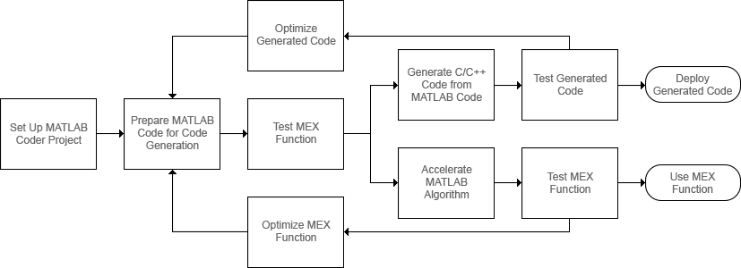{width="6.891666666666667in" height="2.5in"}

### 另请参阅

- "设置 MATLAB Coder 工程"
- "准备 MATLAB 代码以用于代码生成的工作流"
- "Workflow for Testing MEX Functions in MATLAB"
- "代码生成工作流"
- "加速 MATLAB 算法的工作流"
- "优化策略"
- "Accelerate MATLAB Algorithms"

## 代码生成的输入类型设定

C/C++ 和 MATLAB 以不同方式处理变量。影响代码生成工作流的一些差异包括：

- C/C++ 源代码包括所有变量的类型声明。C/C++ 编译器在编译时使用这些声明来确定所有变量的类型。MATLAB 代码不包括显式类型声明。MATLAB 执行引擎在运行时决定变量的类型。
- 在 C/C++ 中，数组的内存可以在编译时静态声明（固定大小数组），也可以在运行时动态分配（可变大小数组）。所有 MATLAB 数组都使用动态分配的内存，大小可变。

要允许生成具有特定类型的 C/C++ 代码，您必须在 C/C++ 或 MEX 代码生成期间指定 MATLAB 入口函数的所有输入变量的属性（类、大小和复/实性）。入口函数是顶层 MATLAB 函数，您可以从中生成代 码。代码生成器使用这些输入属性来确定生成的代码中所有变量的属性。不同的输入类型设定可能导致相同的 MATLAB 代码生成不同版本的代码。

如果使用 **codegen** 命令生成代码，请使用 **-args** 选项指定输入类型。如果使用 MATLAB Coder App 生成代码，请在 **Define Input Types** 页中指定输入类型。

下面以一个简单的 MATLAB 函数 **myMultiply** 为例，说明输入类型设定如何影响生成的代码。该函数将

>> **a** 和 **b** 两个量相乘，并返回乘积的值。
>>

>> **function y = myMultiply(a,b) y = a\*b;**
>>

>> **end**
>>

为输入参数 **a** 和 **b** 的三种不同类型设定生成静态 C 库代码。在每种情况下，检查生成的代码。

- 将 **a** 和 **b** 指定为双精度实数标量。要为这些输入生成代码，请运行以下命令：

>> **a = 1;**
>>

>> **codegen -config:lib myMultiply -args {a,a}**
>>

生成的 C 源文件 **myMultiply.c** 包含 C 函数：

>> **double myMultiply(double a, double b)**
>>

>> **{**
>>

>> **return a \* b;**
>>

>> **}**
>>

- 将 **a** 和 **b** 指定为由双精度实数组成的 **5**×**5** 矩阵。要为这些输入生成代码，请运行以下命令：

>> **a = zeros(5,5);**
>>

>> **codegen -config:lib myMultiply -args {a,a}**
>>

生成的 C 源文件 **myMultiply.c** 包含 C 函数：

>> **void myMultiply(const double a\[25\], const double b\[25\], double y\[25\])**
>>

>> **{**
>>

>> **int i; int i1;**
>>

>> **double d; int i2;**
>>

>> **for (i = 0; i \< 5; i++) {**
>>

>> **for (i1 = 0; i1 \< 5; i1++) { d = 0.0;**
>>

>> **for (i2 = 0; i2 \< 5; i2++) {**
>>

>> **d += a\[i + 5 \* i2\] \* b\[i2 + 5 \* i1\];**
>>

>> **}**
>>

>> **y\[i + 5 \* i1\] = d;**
>>

>> **}**
>>

>> **}**
>>

>> **}**
>>

>> **const double a\[25\]** 和 **const double b\[25\]** 对应于 MATLAB 代码中的输入 **a** 和 **b**。C 代码中一维数组 **a** 和 **b** 的大小是 **25**，这等于在调用 **codegen** 函数时使用的示例输入数组中的元素总数。
>>

C 函数还另有一个参数：一维数组 **y**，其大小为 **25**。它使用此数组返回函数的输出。

您还可以生成与 MATLAB 代码具有相同数组维度的代码。请参阅"Generate Code That Uses N- Dimensional Indexing"。

- 最后，您为 **myMultiply**（它可接受许多不同大小的输入数组）生成代码。要指定可变大小的输入，您可以使用 **coder.typeof** 函数。**coder.typeof(A,B,1)** 指定一个可变大小的输入，其类和复/实性与 **A** 相同，其上限由大小向量 **B** 的对应元素给出。

将 **a** 和 **b** 指定为可变大小的双精度实数数组，任一维度上的最大大小为 **10**。要生成代码，请运行以下命令：

>> **a = coder.typeof(1,\[10 10\],1);**
>>

>> **codegen -config:lib myMultiply -args {a,a}**
>>

生成的 C 函数的签名是：

>> **void myMultiply(const double a_data\[\], const int a_size\[2\], const double b_data\[\], const int b_size\[2\], double y_data\[\], int y_size\[2\])**
>>

参数 **a_data**、**b_data** 和 **y_data** 对应于原始 MATLAB 函数中的输入参数 **a** 和 **b** 以及输出参数 **y**。现在，C 函数接受另外三个参数 **a_size**、**b_size** 和 **y_size**，它们在运行时指定 **a_data**、**b_data** 和 **y_data** 的大小。

### 另请参阅 {#另请参阅}

>> **codegen** \| **coder.typeof**
>>

### 详细信息

- "Specify Properties of Entry-Point Function Inputs"
- ["使用 MATLAB Coder App 生成 C 代码" （第 2-2 页）](#%E4%BD%BF%E7%94%A8-matlab-coder-app-%E7%94%9F%E6%88%90-c-%E4%BB%A3%E7%A0%81)
- ["通过命令行生成 C 代码" （第 2-16 页）](#%E9%80%9A%E8%BF%87%E5%91%BD%E4%BB%A4%E8%A1%8C%E7%94%9F%E6%88%90-c-%E4%BB%A3%E7%A0%81)
- "Generate Code That Uses N-Dimensional Indexing"

## 生成代码和 MATLAB 代码的形式差异

MATLAB Coder 会将动态类型的 MATLAB 代码转换并优化为静态类型的 C/C++ 代码。静态类型语言要求显式声明变量类型，这些类型是在编译时确定的。由生成器进行某些更改和优化后，就能在生成代码中使用 MATLAB 数据类型和功能。有关代码生成支持的数据类型和功能的详细信息，请参阅"数据定义"和 "支持 C/C++ 代码生成的 MATLAB 语言功能"。

这些更改和优化会使生成代码的形式与 MATLAB 代码不同。由于以下任一原因，生成代码可能无法与您的 MATLAB 代码一一对应：

- ["将 MATLAB 函数映射到 C/C++ 函数" （第 1-13 页）](#%E5%B0%86-matlab-%E5%87%BD%E6%95%B0%E6%98%A0%E5%B0%84%E5%88%B0-cc-%E5%87%BD%E6%95%B0)
- ["函数输出的表示形式" （第 1-13 页）](#%E5%87%BD%E6%95%B0%E8%BE%93%E5%87%BA%E7%9A%84%E8%A1%A8%E7%A4%BA%E5%BD%A2%E5%BC%8F)
- ["在生成的代码中删除的常量值" （第 1-14 页）](#%E5%9C%A8%E7%94%9F%E6%88%90%E7%9A%84%E4%BB%A3%E7%A0%81%E4%B8%AD%E5%88%A0%E9%99%A4%E7%9A%84%E5%B8%B8%E9%87%8F%E5%80%BC)
- ["访问矩阵元素" （第 1-15 页）](#%E8%AE%BF%E9%97%AE%E7%9F%A9%E9%98%B5%E5%85%83%E7%B4%A0)
- ["数学运算和其他函数调用" （第 1-15 页）](#%E6%95%B0%E5%AD%A6%E8%BF%90%E7%AE%97%E5%92%8C%E5%85%B6%E4%BB%96%E5%87%BD%E6%95%B0%E8%B0%83%E7%94%A8)
- ["可变大小数组" （第 1-15 页）](#%E5%8F%AF%E5%8F%98%E5%A4%A7%E5%B0%8F%E6%95%B0%E7%BB%84)
- ["生成代码中的局部变量" （第 1-15 页）](#%E7%94%9F%E6%88%90%E4%BB%A3%E7%A0%81%E4%B8%AD%E7%9A%84%E5%B1%80%E9%83%A8%E5%8F%98%E9%87%8F)
- ["生成代码中的元胞数组" （第 1-15 页）](#%E7%94%9F%E6%88%90%E4%BB%A3%E7%A0%81%E4%B8%AD%E7%9A%84%E5%85%83%E8%83%9E%E6%95%B0%E7%BB%84)
- ["初始化函数和终止函数" （第 1-15 页）](#%E5%88%9D%E5%A7%8B%E5%8C%96%E5%87%BD%E6%95%B0%E5%92%8C%E7%BB%88%E6%AD%A2%E5%87%BD%E6%95%B0)

[**注意** 根据您的源代码，这些情况可能会与此处显示的略有不同。]{.underline}

### 将 MATLAB 函数映射到 C/C++ 函数

MATLAB Coder 从 MATLAB 代码生成独立的 C/C++ 代码和 MEX 代码。您的 MATLAB 代码中的单个函数可能会在生成的代码中转换为多个函数。MATLAB 代码中的两个或更多个函数也可能成为生成代码中的单个函数体。此过程称为函数内联。默认情况下，代码生成器使用内部启发式方法来确定是否内联您的函数。有关详细信息，请参阅 **coder.inline** 和"Control Inlining to Fine-Tune Performance and Readability of Generated Code"。

### 函数输出的表示形式

MATLAB 函数的输出可能成为 C 语言中的返回值，也可能成为传引用输入。MATLAB 代码中的标量输出在生成的代码中被视为返回值。

- 函数 **addOne** 具有输入变量 **x** 和输出变量 **y**。在此示例中，**x** 的类型为 **double**。

>> **function y = addOne(x) y = x + 1;**
>>

>> **end**
>>

为该代码段生成的代码如下所示：

>> **double addOne(double x)**
>>

>> **{**
>>

>> **return x + 1.0;**
>>

>> **}**
>>

函数 **addOne**、**x** 的输入在生成的代码中被视为传值变量。MATLAB 函数的输出由生成的代码中的值返回。

- 对于数组，输出可能是传引用。此处显示的代码片段使用 **double** 输入 **x** 和数组输出 **y**。

>> **function y = addMat(x) z = \[1:100\];**
>>

>> **y = z + x; end**
>>

输出变量 **y** 在生成代码中转换为传引用数组变量，如下所示：

>> **void addMat(double x, double y\[100\])**
>>

>> **{**
>>

>> **int i;**
>>

>> **for (i = 0; i \< 100; i++) {**
>>

>> **y\[i\] = ((double)i + 1.0) + x;**
>>

>> **}**
>>

>> **}**
>>

- 对于具有多个输出变量的入口函数，输出可能是生成的代码中的传引用。以下代码段有两个 **double** 标量输出，即 **y** 和 **z**，还有一个 **double** 标量输入 **x**。

>> **function \[z,y\] = splitOne(x)**
>>

>> **y = x + 1;**
>>

>> **z = x + 2; end**
>>

输出变量 **y** 和 **z** 在生成的代码中转换为传引用变量：

>> **void splitOne(double x, double \*z, double \*y)**
>>

>> **{**
>>

>> **\*y = x + 1.0;**
>>

>> **\*z = x + 2.0;**
>>

>> **}**
>>

有关生成代码中入口函数的参数传递行为的详细信息，请参阅"Deploy Generated Code"。

### 在生成的代码中删除的常量值

代码中的常量值可能不会保留在生成的代码中。为了优化生成的代码，可能会删除这些值。常量折叠将删除 MATLAB 代码中可能存在的计算，并用结果替换这些计算。有关详细信息，请参阅 "常量折叠"。

以如下代码片段为例：

>> **function y = removeConst x = ones(10);**
>>

>> **y = x + 1; end**
>>

代码生成器删除常量矩阵 **x** 以节省内存，并将常量值指定为结果。生成的代码如下所示：

>> **void removeConst(double y\[100\])**
>>

>> **{**
>>

>> **int i;**
>>

>> **for (i = 0; i \< 100; i++) { y\[i\] = 2.0;**
>>

>> **}**
>>

>> **}**
>>

MATLAB 代码中非入口函数的未使用输入或常量输入将从生成代码的函数体中删除。

代码生成器的函数特化可以将函数更改为一个版本，在该版本中，可为函数的特定调用自定义输入类型、大小、复/实性或值。这样做是为了以代码复制为代价产生高效的 C 代码。有关详细信息，请参阅 "Specialized Functions or Classes"。

### 访问矩阵元素

在前面的示例中，访问矩阵需要额外的 C/C++ 代码行。**10**×**10** 矩阵在生成的代码中表示为 100 个 **double** 元素的数组。在这种情况下，使用 **for** 循环来访问所有数组元素。C/C++ 不支持许多矩阵运算，因此代码生成器将矩阵和矩阵上的运算转换为数组和类似 **for** 循环的方法来访问这些数组。

### 数学运算和其他函数调用

生成的代码可能使用标准的 C 库来执行您的 MATLAB 代码中的数学运算或其他函数。有关支持的语言函数列表，请参阅"支持 C/C++ 代码生成的 MATLAB 语言功能"。

### 可变大小数组

对于代码生成，数组可以是固定大小，也可以是可变大小。在生成的代码中，可变大小的数组可能以不同格式出现。如果代码生成器可以确定数组的大小，则可以生成固定大小数组的代码。代码生成也适用于具有上界的固定大小数组。在某些情况下，还会生成动态分配的数组。请参阅"可变大小数组的代码生

成"。

固定大小和可变大小数组的代码生成可能会在生成的代码中产生以下变量声明：

>> **double x\[10\]; // Fixed-size array double y_data\[20\];**
>>

>> **int y_size\[2\]; // y_data and y_size denote an upper-bounded array emxArrayReal_T \*z; // Dynamically allocated array**
>>

### 生成代码中的局部变量

如果您的 MATLAB 代码包含占用大量内存的局部变量，则在生成的代码中，可能将它们声明为局部变量、静态局部变量或在生成的代码中传入您的入口函数的 **struct** 中的变量。您可以通过控制为生成的代码分配的内存来控制这种变换。请参阅"Control Stack Space Usage"。

### 生成代码中的元胞数组

要在生成的代码中实现元胞数组，代码生成器可能会将它们转换为 **struct**、静态数组或动态数组。有关详细信息，请参阅 "Code Generation for Cell Arrays"。

### 初始化函数和终止函数

代码生成器可能根据需要产生两个内务处理函数，初始化函数和终止函数。您可以在代码生成报告的 **Generated Code** 选项卡中找到这些函数。初始化函数初始化生成的 C/C++ 入口函数运行的状态。终止函数释放分配的内存并执行其他清理操作。有关详细信息，请参阅"Use Generated Initialize and Terminate Functions"。

### 另请参阅 {#另请参阅-3}

>> **coder.inline**
>>

### 详细信息

- ["使用 MATLAB Coder App 生成 C 代码" （第 2-2 页）](#%E4%BD%BF%E7%94%A8-matlab-coder-app-%E7%94%9F%E6%88%90-c-%E4%BB%A3%E7%A0%81)
- ["通过命令行生成 C 代码" （第 2-16 页）](#%E9%80%9A%E8%BF%87%E5%91%BD%E4%BB%A4%E8%A1%8C%E7%94%9F%E6%88%90-c-%E4%BB%A3%E7%A0%81)
- "语言、函数和对象支持"
- "优化策略"

# 教程

- ["使用 MATLAB Coder App 生成 C 代码" （第 2-2 页）](#%E4%BD%BF%E7%94%A8-matlab-coder-app-%E7%94%9F%E6%88%90-c-%E4%BB%A3%E7%A0%81)
- ["通过命令行生成 C 代码" （第 2-16 页）](#%E9%80%9A%E8%BF%87%E5%91%BD%E4%BB%A4%E8%A1%8C%E7%94%9F%E6%88%90-c-%E4%BB%A3%E7%A0%81)
- ["通过生成 MEX 函数加快 MATLAB 算法的执行速度" （第 2-24 页）](#%E9%80%9A%E8%BF%87%E7%94%9F%E6%88%90-mex-%E5%87%BD%E6%95%B0%E5%8A%A0%E5%BF%AB-matlab-%E7%AE%97%E6%B3%95%E7%9A%84%E6%89%A7%E8%A1%8C%E9%80%9F%E5%BA%A6)
- ["Hello World" （第 2-31 页）](#hello-world)
- ["为平均值滤波器生成代码" （第 2-32 页）](#%E4%B8%BA%E5%B9%B3%E5%9D%87%E5%80%BC%E6%BB%A4%E6%B3%A2%E5%99%A8%E7%94%9F%E6%88%90%E4%BB%A3%E7%A0%81)
- ["代码生成指南：生成可部署的 C/C++ 代码" （第 2-37 页）](#%E4%BB%A3%E7%A0%81%E7%94%9F%E6%88%90%E6%8C%87%E5%8D%97%E7%94%9F%E6%88%90%E5%8F%AF%E9%83%A8%E7%BD%B2%E7%9A%84-cc-%E4%BB%A3%E7%A0%81)
- ["准备 MATLAB 代码以进行代码生成" （第 2-40 页）](#%E5%87%86%E5%A4%87-matlab-%E4%BB%A3%E7%A0%81%E4%BB%A5%E8%BF%9B%E8%A1%8C%E4%BB%A3%E7%A0%81%E7%94%9F%E6%88%90)
- ["从 MATLAB 代码生成 C/C++ 代码" （第 2-42 页）](#%E4%BB%8E-matlab-%E4%BB%A3%E7%A0%81%E7%94%9F%E6%88%90-cc-%E4%BB%A3%E7%A0%81)
- ["测试生成的 C/C++ 代码" （第 2-46 页）](#%E6%B5%8B%E8%AF%95%E7%94%9F%E6%88%90%E7%9A%84-cc-%E4%BB%A3%E7%A0%81)
- ["部署生成的 C/C++ 代码" （第 2-48 页）](#%E9%83%A8%E7%BD%B2%E7%94%9F%E6%88%90%E7%9A%84-cc-%E4%BB%A3%E7%A0%81)

## 使用 MATLAB Coder App 生成 C 代码

在本教程中，您将使用 MATLAB Coder App 为 MATLAB 函数生成一个静态 C 库。首先生成只能接受具有固定预分配大小的输入的 C 代码。然后生成可以接受许多不同大小的输入的 C 代码。

您还可以使用 **codegen** 命令在 MATLAB [命令行中生成代码。有关此工作流的教程，请参阅"通过命令行生成 C 代码" （第 2-16](#%E9%80%9A%E8%BF%87%E5%91%BD%E4%BB%A4%E8%A1%8C%E7%94%9F%E6%88%90-c-%E4%BB%A3%E7%A0%81) 页）。

MATLAB Online 不支持 MATLAB Coder App。要在 MATLAB Online 中生成 C/C++ 代码，请使用

>> **codegen** 命令。
>>

### 教程文件

将教程文件从文件夹 **matlabroot\\help\\toolbox\\coder\\examples\\euclidean** 复制到本地工作文件夹。此处，**matlabroot** 是 MATLAB 安装文件夹，例如 **C:\\Program Files\\MATLAB\\R2019a**。要将这些文件复制到您的当前文件夹，请运行以下 MATLAB 命令：

>> **copyfile(fullfile(matlabroot,\'help\',\'toolbox\',\'coder\',\'examples\',\'euclidean\'))**
>>

本地工作文件夹不能为私有文件夹或 @ 文件夹。本教程使用 **euclidean_data.mat**、**euclidean.m** 和

>> **test.m** 文件。
>>

- MATLAB 数据文件 **euclidean_data.mat** 包含两段数据：三维欧几里德空间中的一个点以及三维欧几里德空间中的一组其他点。更具体地说：

  - **x** 是一个 **3**×**1** 列向量，表示三维欧几里德空间中的一个点。
  - **cb** 是一个 **3**×**216** 数组。**cb** 中的每列都表示三维欧几里德空间中的一个点。
- MATLAB 文件 **euclidean.m** 包含 **euclidean** 函数，该函数在本示例中实现核心算法。该函数接受 **x**

和 **cb** 作为输入。它计算 **x** 和 **cb** 中每个点之间的欧几里德距离，并返回以下量：

- 列向量 **y_min**，它等于 **cb** 中表示与 **x** 距离最近的点的列。
- 列向量 **y_max**，它等于 **cb** 中表示与 **x** 距离最远的点的列。
- 二维向量 **idx**，它包含 **cb** 中向量 **y_min** 和 **y_max** 的列索引。
- 二维向量 **distance**，它包含计算出的到 **x** 的最小和最大距离。

>> **function \[y_min,y_max,idx,distance\] = euclidean(x,cb)**
>>

>> **% Initialize minimum distance as distance to first element of cb**
>>

>> **% Initialize maximum distance as distance to first element of cb idx(1)=1;**
>>

>> **idx(2)=1;**
>>

>> **distance(1)=norm(x-cb(:,1));**
>>

>> **distance(2)=norm(x-cb(:,1));**
>>

>> **% Find the vector in cb with minimum distance to x**
>>

>> **% Find the vector in cb with maximum distance to x for index=2:size(cb,2)**
>>

>> **d=norm(x-cb(:,index)); if d \< distance(1)**
>>

>> **distance(1)=d; idx(1)=index;**
>>

>> **end**
>>

>> **if d \> distance(2)**
>>

>> **distance(2)=d; idx(2)=index;**
>>

>> **end end**
>>

>> **% Output the minimum and maximum distance vectors y_min=cb(:,idx(1));**
>>

>> **y_max=cb(:,idx(2));**
>>

>> **end**
>>

- MATLAB 脚本 **test.m** 将数据文件 **euclidean_data.mat** 加载到工作区中。接着，它调用函数

>> **euclidean** 来计算 **y_min**、**y_max**、**idx** 和 **distance**。然后，脚本在命令行中显示计算出的量。
>>

加载 **euclidean_data.mat** 是在调用核心算法之前执行的预处理步骤。显示结果是后处理步骤。

>> **% Load test data**
>>

>> **load euclidean_data.mat**
>>

>> **% Determine closest and farthest points and corresponding distances \[y_min,y_max,idx,distance\] = euclidean(x,cb);**
>>

>> **% Display output for the closest point disp(\'Coordinates of the closest point are: \'); disp(num2str(y_min\'));**
>>

>> **disp(\[\'Index of the closest point is \', num2str(idx(1))\]); disp(\[\'Distance to the closest point is \', num2str(distance(1))\]);**
>>

>> **disp(newline);**
>>

>> **% Display output for the farthest point disp(\'Coordinates of the farthest point are: \'); disp(num2str(y_max\'));**
>>

>> **disp(\[\'Index of the farthest point is \', num2str(idx(2))\]); disp(\[\'Distance to the farthest point is \', num2str(distance(2))\]);**
>>

>> **提示** 您可以使用 MATLAB Coder 从 MATLAB 函数生成代码。不支持从 MATLAB 脚本生成代码。
>>

请使用测试脚本将预处理和后处理步骤与实现核心算法的函数分隔开。这种做法使您能够轻松地重用您的[算法。您需要为实现核心算法的 MATLAB 函数生成代码。不需要为测试脚本生成代码。]{.underline}

### 为 MATLAB 函数生成 C 代码

#### 运行原始 MATLAB 代码

在 MATLAB 中运行测试脚本 **test.m**。输出显示 **y**、**idx** 和 **distance**。

>> **Coordinates of the closest point are:**
>>

>> **0.8 0.8 0.4**
>>

>> **Index of the closest point is 171 Distance to the closest point is 0.080374**
>>

>> **Coordinates of the farthest point are:**
>>

>> **0 0 1**
>>

>> **Index of the farthest point is 6 Distance to the farthest point is 1.2923**
>>

#### 使 MATLAB 代码适用于代码生成

MATLAB 编辑器中的代码分析器会在您输入代码时持续检查代码。它会报告问题，并提出修改建议，以最大程度地提高性能和可维护性。

1. 在 MATLAB 编辑器中打开 **euclidean.m**。MATLAB 编辑器右上角的代码分析器消息指示标记为绿色。分析器未在代码中检测到错误、警告或改进机会。
2. 在函数声明后面添加 **%#codegen** 指令：

>> **function \[y,idx,distance\] = euclidean(x,cb) %#codegen**
>>

>> **%#codegen** 指令提示代码分析器识别特定于代码生成的警告和错误。代码分析器消息指示标记变为红色，表示它检测到代码生成问题。
>>

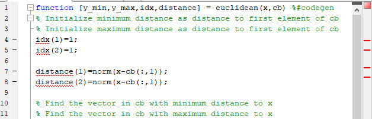{width="6.541665573053368in" height="2.1041666666666665in"}

3. 要查看警告消息，请将光标移到带下划线的代码片段上。警告指示，代码生成要求先对变量 **idx** 和 **distance** 进行完全定义，然后才可以对它们进行下标索引。出现这些警告是因为代码生成器必须在这些变量在代码中首次出现时确定其大小。要解决此问题，请使用 **ones** 函数同时分配和初始化这些数组。

>> **% Initialize minimum distance as distance to first element of cb**
>>

>> **% Initialize maximum distance as distance to first element of cb idx = ones(1,2);**
>>

>> **distance = ones(1,2)\*norm(x-cb(:,1));**
>>

代码分析器消息指示标记再次变为绿色，表示它没有再检测到任何代码生成问题。

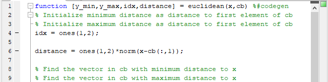{width="6.781248906386701in" height="1.7083333333333333in"}

有关使用代码分析器的详细信息，请参阅"使用代码分析器检查代码中的错误和警告"。

4. 保存文件。

现在您即可使用 MATLAB Coder App 编译您的代码。此处，编译指从您的 MATLAB 代码生成 C/C+

\+ 代码。

>> **注意** 编译 MATLAB 代码指从 MATLAB 代码生成 C/C++ 代码。在其他情况下，"编译"可能指 C/C++[编译器的操作。]{.underline}
>>

#### 打开 MATLAB Coder App 并选择源文件

1. 在 MATLAB 工具条的 **App** 选项卡上，点击**代码生成**下的 MATLAB Coder App 图标。该 App 会打开**选择源文件**页面。
2. 在**选择源文件**页面中，输入或选择入口函数 **euclidean** 的名称。入口函数是顶层 MATLAB 函数，您可以从中生成代码。该 App 将使用默认名称 **euclidean.prj** 在当前文件夹中创建一个工程。

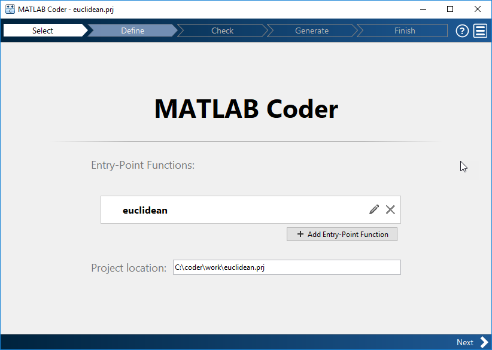{width="7.1925in" height="5.11875in"}

3. 点击**下一步**以转到**定义输入类型**步骤。App 对入口函数运行代码分析器（您已在前面的步骤中运行

过）和代码生成就绪工具。代码生成就绪工具会筛查 MATLAB 代码中是否存在代码生成不支持的功能和函数。如果 App 发现问题，它将打开**检查代码就绪性**页面，您可以在其中查看和解决问题。在此示例中，由于 App 没有检测到问题，因此将打开**定义输入类型**页面。有关详细信息，请参阅"代码生成就绪工具"。

>> **注意** 代码分析器和代码生成就绪工具可能无法检测到所有代码生成问题。消除这两个工具检测到的错误或警告后，请使用 MATLAB Coder 生成代码，以确定您的 MATLAB 代码是否存在其他合规性问
>>

[题。]{.underline}

C/C++ 代码生成支持的某些 MATLAB 内置函数和工具箱函数、类以及 System object 有特定的代码生成限制。这些限制和相关使用说明列在其对应参考页的**扩展功能**部分。有关详细信息，请参阅 "C/C++ 代码生成支持的函数和对象"。

#### 定义输入类型

由于 C 使用静态类型，因此在代码生成时（也称为编译时），代码生成器必须确定 MATLAB 文件中所有变量的类、大小和复/实性。因此，您必须指定所有入口函数输入的属性。要指定输入属性，您可以：

- 指示 App 通过提供使用样本输入调用入口函数的脚本来自动确定输入属性。
- 直接指定属性。

在此示例中，要定义输入 **x** 和 **cb** 的属性，请指定测试文件 **test.m**，代码生成器使用该文件来自动定义类型：

1. 输入或选择测试文件 **test.m**。
2. 点击**自动定义输入类型**。

测试文件 **test.m** 会使用预期的输入类型调用入口函数 **euclidean**。App 确定输入 **x** 为

>> **double(3x1)**，输入 **cb** 为 **double(3x216)**。
>>

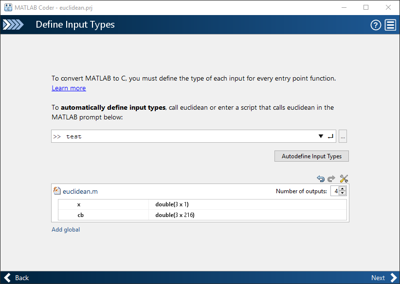{width="7.2003423009623795in" height="5.11875in"}

3. 点击**下一步**以转到**检查运行时问题**步骤。

#### 检查运行时问题

>> **检查运行时问题**步骤从您的入口函数生成 MEX 文件，然后运行 MEX 函数并报告问题。MEX 函数是可从 MATLAB 内部调用的生成的代码。执行此步骤是一个很好的做法，因为您可以检测并解决在生成的 C 代码中更难诊断出来的运行时错误。默认情况下，MEX 函数包括内存完整性检查。这些检查执行数组边界和维度检查，还检测为 MATLAB 函数生成的代码中是否存在内存完整性冲突问题。有关详细信息，请参阅 "Control Run-Time Checks"。
>>

为了将 MATLAB 代码转换为高效的 C/C++ 源代码，代码生成器引入了优化，在某些情况下，这会导致生成的代码与原始源代码在行为上有所不同。请参阅"生成的代码和 MATLAB 代码之间的差异"。

1. 要打开**检查运行时问题**对话框，请点击**检查问题**箭头 {width="0.18747594050743657in" height="0.18747594050743657in"}。
2. 在 **检查运行时问题**对话框中，指定测试文件，或输入使用示例输入调用入口函数的代码。对于此示例，请使用您用来定义输入类型的测试文件 **test**。
3. 点击**检查问题**。

App 将生成一个 MEX 函数。它运行测试脚本 **test**，将对 **euclidean** 的调用替换为对生成的 MEX 的调用。如果 App 在 MEX 函数生成或执行过程中检测到问题，它将提供警告和错误消息。您可以点击这些消息，导航到有问题的代码并修复问题。在本示例中，App 未检测到问题。

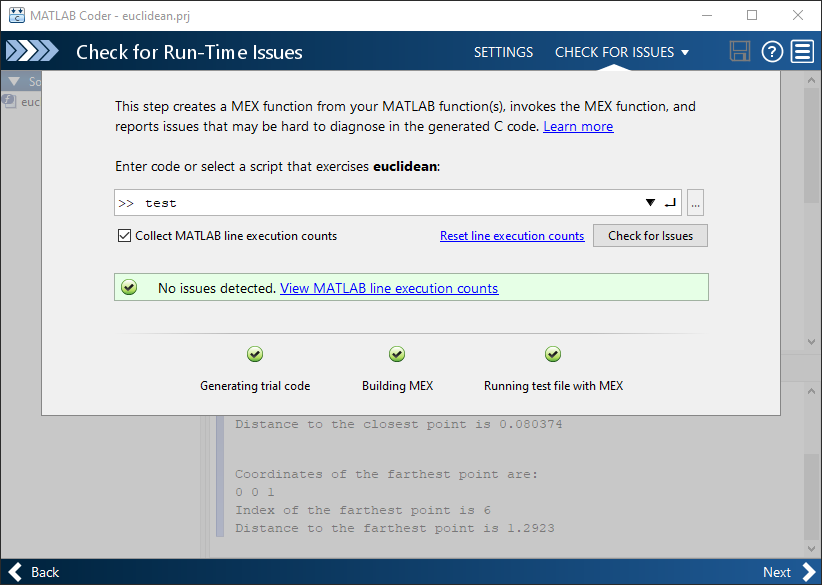{width="7.2003423009623795in" height="5.11875in"}

4. 默认情况下，该 App 会收集行执行计数。这些计数有助于您了解测试文件 **test.m** 执行 **euclidean** 函数的效果。要查看行执行计数，请点击**查看 MATLAB 行执行计数**。App 编辑器在代码左侧显示彩色条。要将彩色突出显示扩展到代码并查看行执行计数，请将光标放在彩色条上。

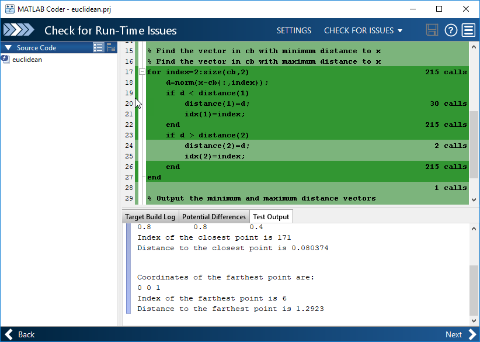{width="7.2003423009623795in" height="5.11875in"}

特定绿色底色表示此代码的行执行计数落在特定范围内。在本例中，**for** 循环执行 215 次。有关如何解释行执行计数和关闭计数集合的信息，请参阅"Collect and View Line Execution Counts for Your MATLAB Code"。

5. 点击**下一步**以转到**生成代码**步骤。

>> **注意** 在从您的 MATLAB 代码生成独立的 C/C++ 代码之前，请生成 MEX 函数。运行生成的 MEX 函数，并确保它具有与您的 MATLAB 函数相同的运行时行为。如果生成的 MEX 函数的执行结果不同于 MATLAB 的结果，或者出错，您必须先修复这些问题，然后生成独立的代码。否则，您生成的独立代码可能不可靠[并且具有未定义的行为。]{.underline}
>>

#### 生成 C 代码

1. 要打开**生成**对话框，请点击**生成**箭头 {width="0.18747594050743657in" height="0.18747594050743657in"}。
2. 在**生成**对话框中，将**编译类型**设置为 "静态库 **(.lib)**"，将**语言**设置为 C。对其他工程编译配置设置使用默认值。

您可以选择生成 MEX 函数或其他 C/C++ 编译类型，而不是生成 C 静态库。MEX 和 C/C++ 编译类型可使用不同工程设置。当您在 MEX 和 C/C++ 代码生成之间切换时，请确认您选择的设置。

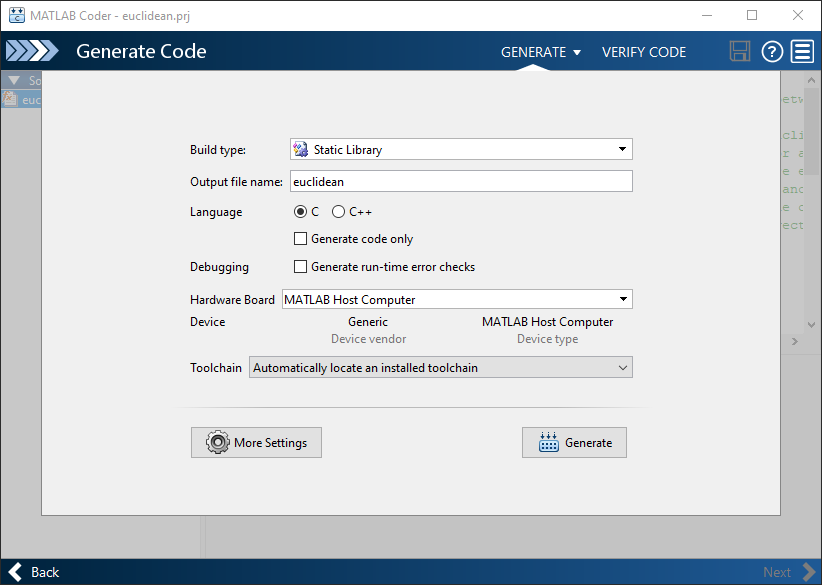{width="7.2003423009623795in" height="5.11875in"}

3. 点击**生成**。

MATLAB Coder 会在 **work\\codegen\\lib\\euclidean** 中生成独立的 C 静态库 **euclidean**。**work** 是包含您的教程文件的文件夹。MATLAB Coder App 指示代码生成成功。它在页面左侧显示源 MATLAB 文件和生成的输出文件。在**变量**选项卡上，它显示有关 MATLAB 源变量的信息。在**目标编译日志** 选项卡上，它会显示编译日志，包括 C/C++ 编译器警告和错误。默认情况下，在代码窗口

中，该 App 将显示 C 源代码文件 **euclidean.c**。要查看不同的文件，请在**源代码**或**输出文件**窗格中，点击文件名称。

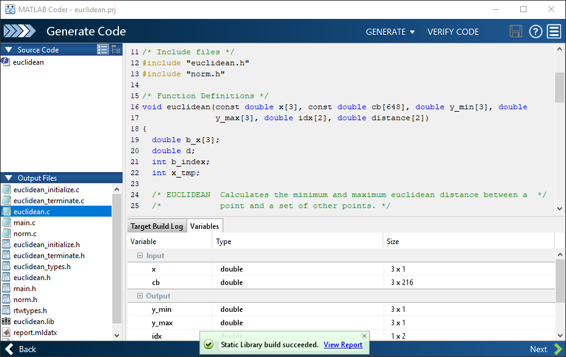{width="7.1621402012248465in" height="4.509374453193351in"}

4. 点击**查看报告**在报告查看器中查看报告。如果代码生成器在代码生成过程中检测到错误或警告，报告将说明问题并提供有问题的 MATLAB 代码的链接。有关详细信息，请参阅"Code Generation Reports"。
5. 点击**下一步**打开**完成工作流**页面。

#### 查看"完成工作流"页面

>> **完成工作流**页面指示已成功生成代码，它提供工程摘要以及指向生成的输出的链接。
>>

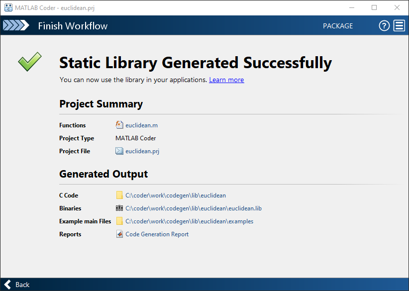{width="7.2003423009623795in" height="5.11875in"}

#### 将生成的 C 代码与原始 MATLAB 代码进行比较

要将生成的 C 代码与原始 MATLAB 代码进行比较，请在 MATLAB 编辑器中打开 C 文件 **euclidean.c** 和

#### euclidean.m 文件。

关于生成的 C 代码的重要信息：

- 函数签名为：

>> **void euclidean(const double x\[3\], const double cb\[648\], double y_min\[3\], double y_max\[3\], double idx\[2\], double distance\[2\])**
>>

>> **const double x\[3\]** 对应于您的 MATLAB 代码中的输入 **x**。**x** 的大小为 **3**，对应于您在从 MATLAB 代码生成代码时使用的示例输入的总大小 (3×1)。
>>

>> **const double cb\[648\]** 对应于您的 MATLAB 代码中的输入 **cb**。**cb** 的大小为 **648**，对应于您在从 MATLAB 代码生成代码时使用的示例输入的总大小 (3×216)。在本例中，生成的代码使用一维数组来表示 MATLAB 代码中的二维数组。
>>

生成的代码有四个额外的输入参数：数组 **y_min**、**y_max**、**idx** 和 **distance**。这些数组用于返回输出值。它们对应于原始 MATLAB 代码中的输出参数 **y_min**、**y_max**、**idx** 和 **distance**。

- 代码生成器将保留您的函数名称和注释。如果可能，代码生成器会保留您的变量名称。

>> **注意** 如果您的 MATLAB 代码中的某个变量设置为常量值，它在生成的 C 代码中将不会显示为变量。[在这种情况下，生成的 C 代码将包含该变量的实际值。]{.underline}
>>

使用 Embedded Coder，您可以在 MATLAB 代码和生成的 C/C++ 代码之间进行交互式追溯。请参阅 "Interactively Trace Between MATLAB Code and Generated C/C++ Code" (Embedded Coder)。

### 为可变大小输入生成 C 代码

您为 **euclidean.m** 生成的 C 函数只能接受与您在代码生成期间指定的样本输入具有相同大小的输入。但是，对应的 MATLAB 函数的输入数组可以具有任意大小。在本教程的此部分，您将从 **euclidean.m** 中生成接受可变大小输入的 C 代码。

假设您希望生成的 C 代码中的 **x** 和 **cb** 的维度具有以下属性：

- **x** 和 **cb** 的第一个维度的大小为可变大小，但不超过 **3**。
- **x** 的第二个维度具有固定大小，其值为 **1**。
- **cb** 的第二个维度的大小为可变大小，但不超过 **216**。

要指定这些输入属性，请执行以下操作：

1. 在**定义输入类型** 步骤中，像以前一样输入测试文件 **test.m**，然后点击**自动定义输入类型**。测试文件使用预期的输入类型调用入口函数 **euclidean.m**。App 确定输入 **x** 为 **double(3x1)**，输入 **cb** 为 **double(3x216)**。这些类型指定固定大小的输入。
2. 点击输入类型设定并编辑它们。您可以通过使用 **:** 前缀来指定可变大小，最高不超过指定的限制。例如，**:3** 表示对应维度具有可变大小，但不超过 **3**。将 **x** 的类型更改为 **double(:3 x 1)**，将 **cb** 的类型更改为 **double(:3 x :216)**。

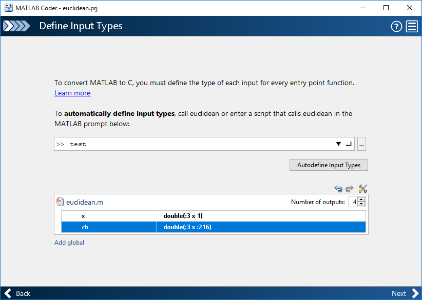{width="7.2003423009623795in" height="5.11875in"}

现在，您可以按照与以前相同的步骤生成代码。**euclidean.c** 中生成的 C 代码的函数签名现在为：

>> **void euclidean(const double x_data\[\], const int x_size\[1\], const double cb_data\[\], const int cb_size\[2\], double y_min_data\[\], int y_min_size\[1\],**
>>

>> **double y_max_data\[\], int y_max_size\[1\], double idx\[2\], double distance\[2\])**
>>

参数 **x_data**、**cb_data**、**y_min_data** 和 **y_max_data** 对应于原始 MATLAB 函数中的输入参数 **x** 和 **cb** 以及输出参数 **y_min** 和 **y_max**。现在，C 函数接受四个额外的输入参数，即 **x_size**、**cb_size**、 **y_min_size** 和 **y_max_size**，它们在运行时指定 **x_data**、**cb_data**、**y_min_data** 和 **y_max_data** 的大小。

### 接下来的步骤

+-------------------------------------------------------------------------+-----------------------------------+
| >> **目的**                                                              | **更多信息**                      |
+=========================================================================+===================================+
| > 了解对 MATLAB 内置函数和工具箱函数、类和 System object 的代码生成支持 | "C/C++ 代码生成支持的函数和对象"  |
+-------------------------------------------------------------------------+-----------------------------------+
| > 生成 C++ 代码                                                         | "C++ 代码生成"                    |
+-------------------------------------------------------------------------+-----------------------------------+

+--------------------------------------------------------+-------------------------------------------------------------------------------------+
| >> **目的**                                             | **更多信息**                                                                        |
+========================================================+=====================================================================================+
| > 生成并修改示例 C 主函数，并使用它来编译 C 可执行程序 | "在应用程序中使用示例 C 主函数"                                                     |
+--------------------------------------------------------+-------------------------------------------------------------------------------------+
| > 将生成的文件打包为压缩文件                           | "Package Code for Other Development Environments"                                   |
+--------------------------------------------------------+-------------------------------------------------------------------------------------+
| > 优化所生成的代码的执行速度或内存使用量。             | "优化策略"                                                                          |
+--------------------------------------------------------+-------------------------------------------------------------------------------------+
| > 将您的自定义 C/C++ 代码集成到生成的代码中            | "从生成的代码中调用自定义 C/C++ 代码"                                               |
+--------------------------------------------------------+-------------------------------------------------------------------------------------+
| > 了解代码生成报告                                     | "Code Generation Reports"                                                           |
|                                                        |                                                                                     |
|                                                        | "Interactively Trace Between MATLAB Code and Generated C/C++ Code" (Embedded Coder) |
+--------------------------------------------------------+-------------------------------------------------------------------------------------+

## 通过命令行生成 C 代码

在本教程中，您将使用 MATLAB Coder**codegen** 命令为 MATLAB 函数生成静态 C 库。首先生成只能接受具有固定预分配大小的输入的 C 代码。然后生成可以接受许多不同大小的输入的 C 代码。

您还可以使用 MATLAB Coder App 生成代码。有关此工作流的教程，请参阅"使用 [MATLAB Coder](#%E4%BD%BF%E7%94%A8-matlab-coder-app-%E7%94%9F%E6%88%90-c-%E4%BB%A3%E7%A0%81) [App 生成 C 代码" （第 2-2](#%E4%BD%BF%E7%94%A8-matlab-coder-app-%E7%94%9F%E6%88%90-c-%E4%BB%A3%E7%A0%81) 页）。

### 教程文件

将教程文件从文件夹 **matlabroot\\help\\toolbox\\coder\\examples\\euclidean** 复制到本地工作文件夹。此处，**matlabroot** 是 MATLAB 安装文件夹，例如 **C:\\Program Files\\MATLAB\\R2019a**。要将这些文件复制到您的当前文件夹，请运行以下 MATLAB 命令：

>> **copyfile(fullfile(matlabroot,\'help\',\'toolbox\',\'coder\',\'examples\',\'euclidean\'))**
>>

本地工作文件夹不能为私有文件夹或 @ 文件夹。本教程使用 **euclidean_data.mat**、**euclidean.m**、 **test.m**、**build_lib_fixed.m** 和 **build_lib_variable.m** 文件。

- MATLAB 数据文件 **euclidean_data.mat** 包含两段数据：三维欧几里德空间中的一个点以及三维欧几里德空间中的一组其他点。更具体地说：

  - **x** 是一个 **3**×**1** 列向量，表示三维欧几里德空间中的一个点。
  - **cb** 是一个 **3**×**216** 数组。**cb** 中的每列都表示三维欧几里德空间中的一个点。
- MATLAB 文件 **euclidean.m** 包含 **euclidean** 函数，该函数在本示例中实现核心算法。该函数接受 **x**

和 **cb** 作为输入。它计算 **x** 和 **cb** 中每个点之间的欧几里德距离，并返回以下量：

- 列向量 **y_min**，它等于 **cb** 中表示与 **x** 距离最近的点的列。
- 列向量 **y_max**，它等于 **cb** 中表示与 **x** 距离最远的点的列。
- 二维向量 **idx**，它包含 **cb** 中向量 **y_min** 和 **y_max** 的列索引。
- 二维向量 **distance**，它包含计算出的到 **x** 的最小和最大距离。

>> **function \[y_min,y_max,idx,distance\] = euclidean(x,cb)**
>>

>> **% Initialize minimum distance as distance to first element of cb**
>>

>> **% Initialize maximum distance as distance to first element of cb idx(1)=1;**
>>

>> **idx(2)=1;**
>>

>> **distance(1)=norm(x-cb(:,1));**
>>

>> **distance(2)=norm(x-cb(:,1));**
>>

>> **% Find the vector in cb with minimum distance to x**
>>

>> **% Find the vector in cb with maximum distance to x for index=2:size(cb,2)**
>>

>> **d=norm(x-cb(:,index)); if d \< distance(1)**
>>

>> **distance(1)=d; idx(1)=index;**
>>

>> **end**
>>

>> **if d \> distance(2) distance(2)=d; idx(2)=index;**
>>

>> **end end**
>>

>> **% Output the minimum and maximum distance vectors y_min=cb(:,idx(1));**
>>

>> **y_max=cb(:,idx(2));**
>>

>> **end**
>>

- MATLAB 脚本 **test.m** 将数据文件 **euclidean_data.mat** 加载到工作区中。接着，它调用函数

>> **euclidean** 来计算 **y_min**、**y_max**、**idx** 和 **distance**。然后，脚本在命令行中显示计算出的量。
>>

加载 **euclidean_data.mat** 是在调用核心算法之前执行的预处理步骤。显示结果是后处理步骤。

>> **% Load test data**
>>

>> **load euclidean_data.mat**
>>

>> **% Determine closest and farthest points and corresponding distances \[y_min,y_max,idx,distance\] = euclidean(x,cb);**
>>

>> **% Display output for the closest point disp(\'Coordinates of the closest point are: \'); disp(num2str(y_min\'));**
>>

>> **disp(\[\'Index of the closest point is \', num2str(idx(1))\]); disp(\[\'Distance to the closest point is \', num2str(distance(1))\]);**
>>

>> **disp(newline);**
>>

>> **% Display output for the farthest point disp(\'Coordinates of the farthest point are: \'); disp(num2str(y_max\'));**
>>

>> **disp(\[\'Index of the farthest point is \', num2str(idx(2))\]); disp(\[\'Distance to the farthest point is \', num2str(distance(2))\]);**
>>

- 编译脚本 **build_lib_fixed.m** 和 **build_lib_variable.m** 包含的命令可从您的 MATLAB 代码生成静态 C 库，这两个库分别接受固定大小和可变大小输入。这些脚本的内容显示在本教程后面有关生成 C 代码的部分中。

>> **提示** 您可以使用 MATLAB Coder 从 MATLAB 函数生成代码。不支持从 MATLAB 脚本生成代码。
>>

请使用测试脚本将预处理和后处理步骤与实现核心算法的函数分隔开。这种做法使您能够轻松地重用您的[算法。您需要为实现核心算法的 MATLAB 函数生成代码。不需要为测试脚本生成代码。]{.underline}

### 为 MATLAB 函数生成 C 代码

#### 运行原始 MATLAB 代码

在 MATLAB 中运行测试脚本 **test.m**。输出显示 **y**、**idx** 和 **distance**。

>> **Coordinates of the closest point are:**
>>

>> **0.8 0.8 0.4**
>>

>> **Index of the closest point is 171 Distance to the closest point is 0.080374**
>>

>> **Coordinates of the farthest point are:**
>>

>> **0 0 1**
>>

>> **Index of the farthest point is 6 Distance to the farthest point is 1.2923**
>>

#### 使 MATLAB 代码适用于代码生成

为了使您的 MATLAB 代码适用于代码生成，您可以使用代码分析器和代码生成就绪工具。MATLAB 编辑器中的代码分析器会在您输入代码时持续检查代码。它会报告问题，并提出修改建议，以最大程度地提高性能和可维护性。代码生成就绪工具会筛查 MATLAB 代码中是否存在代码生成不支持的功能和函数。

C/C++ 代码生成支持的某些 MATLAB 内置函数和工具箱函数、类以及 System object 有特定的代码生成限制。这些限制和相关使用说明列在其对应参考页的**扩展功能**部分。有关详细信息，请参阅 "C/C++ 代码生成支持的函数和对象"。

1. 在 MATLAB 编辑器中打开 **euclidean.m**。MATLAB 编辑器右上角的代码分析器消息指示标记为绿色。分析器未在代码中检测到错误、警告或改进机会。
2. 在函数声明后面添加 **%#codegen** 指令：

>> **function \[y,idx,distance\] = euclidean(x,cb) %#codegen**
>>

>> **%#codegen** 指令提示代码分析器识别特定于代码生成的警告和错误。代码分析器消息指示标记变为红色，表示它检测到代码生成问题。
>>

{width="6.541665573053368in" height="2.1041666666666665in"}

3. 要查看警告消息，请将光标移到带下划线的代码片段上。警告指示，代码生成要求先对变量 **idx** 和 **distance** 进行完全定义，然后才可以对它们进行下标索引。出现这些警告是因为代码生成器必须在这些变量在代码中首次出现时确定其大小。要解决此问题，请使用 **ones** 函数同时分配和初始化这些数组。

>> **% Initialize minimum distance as distance to first element of cb**
>>

>> **% Initialize maximum distance as distance to first element of cb idx = ones(1,2);**
>>

>> **distance = ones(1,2)\*norm(x-cb(:,1));**
>>

代码分析器消息指示标记再次变为绿色，表示它没有再检测到任何代码生成问题。

{width="6.8033770778652665in" height="1.7083333333333333in"}

有关使用代码分析器的详细信息，请参阅"使用代码分析器检查代码中的错误和警告"。

4. 保存文件。
5. 要运行代码生成就绪工具，请从 MATLAB 命令行调用 **coder.screener** 函数。

>> **coder.screener(\'euclidean\')**
>>

该工具不会检测 **euclidean** 的任何代码生成问题。有关详细信息，请参阅"代码生成就绪工具"。 MATLAB Online 不支持代码生成就绪工具。

>> **注意** 代码分析器和代码生成就绪工具可能无法检测到所有代码生成问题。消除这两个工具检测到的错[误或警告后，使用 MATLAB Coder 生成代码以确定您的 MATLAB 代码是否还存在其他合规性问题。]{.underline}
>>

现在您即可使用 MATLAB Coder App 编译您的代码。此处，编译指从您的 MATLAB 代码生成 C/C++ 代码。

>> **注意** 编译 MATLAB 代码指从 MATLAB 代码生成 C/C++ 代码。在其他情况下，"编译"可能指 C/C++[编译器的操作。]{.underline}
>>

#### 定义输入类型

由于 C 使用静态类型，因此在代码生成时（也称为编译时），代码生成器必须确定 MATLAB 文件中所有变量的类、大小和复/实性。因此，在为文件生成代码时，必须指定入口函数的所有输入参数的属性。入口函数是顶层 MATLAB 函数，您可以从中生成代码。

当您使用 **codegen** 命令生成代码时，请使用 **-args** 选项指定入口函数的示例输入参数。代码生成器使用这些信息来确定输入参数的属性。

在下一步中，您将使用 **codegen** 命令从入口函数 **euclidean** 生成 MEX 文件。

#### 检查运行时问题

您从入口函数生成 MEX 函数。MEX 函数是可从 MATLAB 内部调用的生成的代码。运行该 MEX 函数，检查生成的 MEX 函数和原始的 MATLAB 函数是否具有相同的功能。

执行此步骤是一个很好的做法，因为您可以检测并解决在生成的 C 代码中更难诊断出来的运行时错误。默认情况下，MEX 函数包括内存完整性检查。这些检查执行数组边界和维度检查，还检测为 MATLAB 函数生成的代码中是否存在内存完整性冲突问题。有关详细信息，请参阅"Control Run-Time Checks"。

为了将 MATLAB 代码转换为高效的 C/C++ 源代码，代码生成器引入了优化，在某些情况下，这会导致生成的代码与原始源代码在行为上有所不同。请参阅"生成的代码和 MATLAB 代码之间的差异"。

>> **1** 使用 **codegen** 命令为 **euclidean.m** 生成 MEX 文件。要验证 MEX 函数，请运行测试脚本 **test**，并将调用 MATLAB 函数 **euclidean** 替换为调用生成的 MEX 函数。
>>

>> **codegen euclidean.m -args {x,cb} -test test**
>>

- 默认情况下，**codegen** 在当前文件夹中生成名为 **euclidean_mex** 的 MEX 函数。
- 您可以使用 **-args** 选项指定入口函数 **euclidean** 的示例输入参数。代码生成器使用这些信息来确定输入参数的属性。
- 您使用 **-test** 选项运行测试文件 **test.m**。此选项将测试文件中对 **euclidean** 的调用替换为对

>> **euclidean_mex** 的调用。
>>

输出为：

>> **Running test file: \'test\' with MEX function \'euclidean_mex\'. Coordinates of the closest point are:**
>>

>> **0.8 0.8 0.4**
>>

>> **Index of the closest point is 171 Distance to the closest point is 0.080374**
>>

>> **Coordinates of the farthest point are:**
>>

>> **0 0 1**
>>

>> **Index of the farthest point is 6 Distance to the farthest point is 1.2923**
>>

此输出与原始 MATLAB 函数生成的输出相匹配，并验证 MEX 函数。现在，您可以为 **euclidean** 生成独立的 C 代码。

>> **注意** 在从您的 MATLAB 代码生成独立的 C/C++ 代码之前，请生成 MEX 函数。运行生成的 MEX 函数，并确保它具有与您的 MATLAB 函数相同的运行时行为。如果生成的 MEX 函数的执行结果不同于 MATLAB 的结果，或者出错，您必须先修复这些问题，然后生成独立的代码。否则，您生成的独立代码可能不可靠[并且具有未定义的行为。]{.underline}
>>

#### 生成 C 代码

编译脚本 **build_lib_fixed.m** 包含用于为 **euclidean.m** 生成代码的命令。

>> **% Load the test data load euclidean_data.mat**
>>

>> **% Generate code for euclidean.m with codegen. Use the test data as example input. codegen -report -config:lib euclidean.m -args {x, cb}**
>>

请注意：

- **codegen** 读取文件 **euclidean.m**，并将 MATLAB 代码转换为 C 代码。
- **-report** 选项指示 **codegen** 生成代码生成报告，您可使用该报告调试代码生成问题，并验证您的 MATLAB 代码是否适用于代码生成。
- **-config:lib** 选项指示 **codegen** 生成静态 C 库，而不是生成默认 MEX 函数。
- **-args** 选项指示 **codegen** 使用示例输入参数 **x** 和 **cb** 的类、大小和复/实性为 **euclidean.m** 生成代码。

您可以通过使用适当的选项和 **codegen** 命令，选择生成 MEX 函数或其他 C/C++ 编译类型，而不是生成 C 静态库。有关各种代码生成选项的详细信息，请参阅 **codegen**。

1. 运行编译脚本。

MATLAB 会处理编译文件，并输出以下消息：

>> **Code generation successful: View report.**
>>

代码生成器在 **work\\codegen\\lib\\euclidean** 中生成独立的 C 静态库 **euclidean**。此处，**work**

是包含您的教程文件的文件夹。

2. 要在 Report Viewer 中查看代码生成报告，请点击 **View report**。

如果代码生成器在代码生成过程中检测到错误或警告，报告将说明问题并提供有问题的 MATLAB 代码的链接。请参阅"Code Generation Reports"。

>> **提示** 在命令行使用编译脚本生成代码。编译脚本自动执行您在命令行重复执行的一系列 MATLAB 命令，[可帮助您节省时间和消除输入错误。]{.underline}
>>

#### 将生成的 C 代码与原始 MATLAB 代码进行比较

要将生成的 C 代码与原始 MATLAB 代码进行比较，请在 MATLAB 编辑器中打开 C 文件 **euclidean.c** 和

#### euclidean.m 文件。

关于生成的 C 代码的重要信息：

- 函数签名为：

>> **void euclidean(const double x\[3\], const double cb\[648\], double y_min\[3\], double y_max\[3\], double idx\[2\], double distance\[2\])**
>>

>> **const double x\[3\]** 对应于您的 MATLAB 代码中的输入 **x**。**x** 的大小是 **3**，它对应于您在为 MATLAB 生成代码时使用的示例输入的总大小 (3×1)。
>>

>> **const double cb\[648\]** 对应于您的 MATLAB 代码中的输入 **cb**。**cb** 的大小是 **648**，它对应于您在为 MATLAB 生成代码时使用的示例输入的总大小 (3×216)。在本例中，生成的代码使用一维数组来表示 MATLAB 代码中的二维数组。
>>

生成的代码有四个额外的输入参数：数组 **y_min**、**y_max**、**idx** 和 **distance**。这些数组用于返回输出值。它们对应于原始 MATLAB 代码中的输出参数 **y_min**、**y_max**、**idx** 和 **distance**。

- 代码生成器将保留您的函数名称和注释。如果可能，代码生成器会保留您的变量名称。

>> **注意** 如果您的 MATLAB 代码中的某个变量设置为常量值，它在生成的 C 代码中将不会显示为变量。[在这种情况下，生成的 C 代码将包含该变量的实际值。]{.underline}
>>

使用 Embedded Coder，您可以在 MATLAB 代码和生成的 C/C++ 代码之间进行交互式追溯。请参阅 "Interactively Trace Between MATLAB Code and Generated C/C++ Code" (Embedded Coder)。

### 为可变大小输入生成 C 代码

您为 **euclidean.m** 生成的 C 函数只能接受与您在代码生成期间指定的样本输入具有相同大小的输入。但是，对应的 MATLAB 函数的输入数组可以具有任意大小。在本教程的此部分，您将从 **euclidean.m** 中生成接受可变大小输入的 C 代码。

假设您希望生成的 C 代码中的 **x** 和 **cb** 的维度具有以下属性：

- **x** 和 **cb** 的第一个维度的大小为可变大小，但不超过 **3**。
- **x** 的第二个维度具有固定大小，其值为 **1**。
- **cb** 的第二个维度的大小为可变大小，但不超过 **216**。

要指定这些输入属性，请使用 **coder.typeof** 函数。**coder.typeof(A,B,1)** 指定一个可变大小的输入，其类和复/实性与 **A** 相同，其上限由大小向量 **B** 的对应元素给出。使用编译脚本 **build_lib_variable.m**，该脚本使用 **coder.typeof** 在生成的 C 库中指定可变大小输入的属性。

>> **% Load the test data load euclidean_data.mat**
>>

>> **% Use coder.typeof to specify variable-size inputs eg_x=coder.typeof(x,\[3 1\],1);**
>>

>> **eg_cb=coder.typeof(cb,\[3 216\],1);**
>>

>> **% Generate code for euclidean.m using coder.typeof to specify**
>>

>> **% upper bounds for the example inputs**
>>

>> **codegen -report -config:lib euclidean.m -args {eg_x,eg_cb}**
>>

现在，您可以按照与以前相同的步骤生成代码。**euclidean.c** 中生成的 C 代码的函数签名现在为：

>> **void euclidean(const double x_data\[\], const int x_size\[1\], const double cb_data\[\], const int cb_size\[2\], double y_min_data\[\], int y_min_size\[1\],**
>>

>> **double y_max_data\[\], int y_max_size\[1\], double idx\[2\], double distance\[2\])**
>>

参数 **x_data**、**cb_data**、**y_min_data** 和 **y_max_data** 对应于原始 MATLAB 函数中的输入参数 **x** 和 **cb** 以及输出参数 **y_min** 和 **y_max**。现在，C 函数接受四个额外的输入参数，即 **x_size**、**cb_size**、 **y_min_size** 和 **y_max_size**，它们在运行时指定 **x_data**、**cb_data**、**y_min_data** 和 **y_max_data** 的大小。

### 接下来的步骤

+-------------------------------------------------------------------------+--------------------------------------------------------------+
| >> **目的**                                                              | **更多信息**                                                 |
+=========================================================================+==============================================================+
| > 了解对 MATLAB 内置函数和工具箱函数、类和 System object 的代码生成支持 | "C/C++ 代码生成支持的函数和对象"                             |
+-------------------------------------------------------------------------+--------------------------------------------------------------+
| > 生成 C++ 代码                                                         | "C++ 代码生成"                                               |
+-------------------------------------------------------------------------+--------------------------------------------------------------+
| > 以交互方式创建和编辑输入类型                                          | "Create and Edit Input Types by Using the Coder Type Editor" |
+-------------------------------------------------------------------------+--------------------------------------------------------------+
| > 生成并修改示例 C 主函数，并使用它来编译 C 可执行程序                  | "在应用程序中使用示例 C 主函数"                              |
+-------------------------------------------------------------------------+--------------------------------------------------------------+
| > 将生成的文件打包为压缩文件                                            | "Package Code for Other Development Environments"            |
+-------------------------------------------------------------------------+--------------------------------------------------------------+

+---------------------------------------------+-------------------------------------------------------------------------------------+
| >> **目的**                                  | **更多信息**                                                                        |
+=============================================+=====================================================================================+
| > 优化所生成的代码的执行速度或内存使用量。  | "优化策略"                                                                          |
+---------------------------------------------+-------------------------------------------------------------------------------------+
| > 将您的自定义 C/C++ 代码集成到生成的代码中 | "从生成的代码中调用自定义 C/C++ 代码"                                               |
+---------------------------------------------+-------------------------------------------------------------------------------------+
| > 了解代码生成报告                          | "Code Generation Reports"                                                           |
|                                             |                                                                                     |
|                                             | "Interactively Trace Between MATLAB Code and Generated C/C++ Code" (Embedded Coder) |
+---------------------------------------------+-------------------------------------------------------------------------------------+

>> **另请参阅**
>>

>> **codegen** \| **coder.screener**
>>

## 通过生成 MEX 函数加快 MATLAB 算法的执行速度

您可以使用 MATLAB Coder 从 MATLAB 代码生成 MEX 函数。MEX 函数是一个 MATLAB 可执行文件。它是可以从 MATLAB 内部调用的生成代码。在 MATLAB 环境内工作时，使用 MEX 函数可加快 MATLAB 代码的计算密集型部分的执行速度。通过使用 MATLAB Coder App 或在 MATLAB 命令行中使用 **codegen**，从您的 MATLAB 代码生成一个 MEX 函数。

在本教程中，您将使用 MATLAB Coder**codegen** 命令为 MATLAB 函数生成 MEX 函数。首先，您需要生成一个 MEX 函数，该函数只能接受具有预分配的固定大小的输入。然后生成另一个 MEX 函数，该函数可以接受具有许多不同大小的输入。

### 教程文件

将教程文件从文件夹 **matlabroot\\help\\toolbox\\coder\\examples\\euclidean** 复制到本地工作文件夹。此处，**matlabroot** 是 MATLAB 安装文件夹，例如 **C:\\Program Files\\MATLAB\\R2019a**。要将这些文件复制到您的当前文件夹，请运行以下 MATLAB 命令：

>> **copyfile(fullfile(matlabroot,\'help\',\'toolbox\',\'coder\',\'examples\',\'euclidean\'))**
>>

本地工作文件夹不能为私有文件夹或 @ 文件夹。本教程使用 **euclidean_data.mat**、**euclidean.m**、 **test.m**、**test_2d.m**、**build_mex_fixed.m** 和 **build_mex_variable.m** 文件。

- MATLAB 数据文件 **euclidean_data.mat** 包含两段数据：三维欧几里德空间中的一个点以及三维欧几里德空间中的一组其他点。更具体地说：

  - **x** 是一个 **3**×**1** 列向量，表示三维欧几里德空间中的一个点。
  - **cb** 是一个 **3**×**216** 数组。**cb** 中的每列都表示三维欧几里德空间中的一个点。
- MATLAB 文件 **euclidean.m** 包含 **euclidean** 函数，该函数在本示例中实现核心算法。该函数接受 **x**

和 **cb** 作为输入。它计算 **x** 和 **cb** 中每个点之间的欧几里德距离，并返回以下量：

- 列向量 **y_min**，它等于 **cb** 中表示与 **x** 距离最近的点的列。
- 列向量 **y_max**，它等于 **cb** 中表示与 **x** 距离最远的点的列。
- 二维向量 **idx**，它包含 **cb** 中向量 **y_min** 和 **y_max** 的列索引。
- 二维向量 **distance**，它包含计算出的到 **x** 的最小和最大距离。

>> **function \[y_min,y_max,idx,distance\] = euclidean(x,cb)**
>>

>> **% Initialize minimum distance as distance to first element of cb**
>>

>> **% Initialize maximum distance as distance to first element of cb idx(1)=1;**
>>

>> **idx(2)=1;**
>>

>> **distance(1)=norm(x-cb(:,1));**
>>

>> **distance(2)=norm(x-cb(:,1));**
>>

>> **% Find the vector in cb with minimum distance to x**
>>

>> **% Find the vector in cb with maximum distance to x for index=2:size(cb,2)**
>>

>> **d=norm(x-cb(:,index)); if d \< distance(1)**
>>

>> **distance(1)=d; idx(1)=index;**
>>

>> **end**
>>

>> **if d \> distance(2)**
>>

>> **distance(2)=d; idx(2)=index;**
>>

>> **end end**
>>

>> **% Output the minimum and maximum distance vectors y_min=cb(:,idx(1));**
>>

>> **y_max=cb(:,idx(2));**
>>

>> **end**
>>

- MATLAB 脚本 **test.m** 将数据文件 **euclidean_data.mat** 加载到工作区中。它调用函数 **euclidean**

计算 **y_min**、**y_max**、**idx** 和 **distance**。然后，脚本在命令行中显示计算出的量。

加载 **euclidean_data.mat** 是在调用核心算法之前执行的预处理步骤。显示结果是后处理步骤。

>> **% Load test data**
>>

>> **load euclidean_data.mat**
>>

>> **% Determine closest and farthest points and corresponding distances \[y_min,y_max,idx,distance\] = euclidean(x,cb);**
>>

>> **% Display output for the closest point disp(\'Coordinates of the closest point are: \'); disp(num2str(y_min\'));**
>>

>> **disp(\[\'Index of the closest point is \', num2str(idx(1))\]); disp(\[\'Distance to the closest point is \', num2str(distance(1))\]);**
>>

>> **disp(newline);**
>>

>> **% Display output for the farthest point disp(\'Coordinates of the farthest point are: \'); disp(num2str(y_max\'));**
>>

>> **disp(\[\'Index of the farthest point is \', num2str(idx(2))\]); disp(\[\'Distance to the farthest point is \', num2str(distance(2))\]);**
>>

- MATLAB 脚本 **test_2d.m** 是表示二维欧几里德空间中点的 **test.m** 的修改版。**test_2d.m** 的内容将在本教程后面显示，您可以使用它来针对可变大小输入测试 MEX 函数。
- 编译脚本 **build_mex_fixed.m** 和 **build_mex_variable.m** 包含的命令可从您的 MATLAB 代码生成静态 C 库，这两个库分别接受固定大小和可变大小输入。这些脚本的内容显示在本教程后面有关生成 C 代码的部分中。

>> **提示** 您可以使用 MATLAB Coder 从 MATLAB 函数生成代码。不支持从 MATLAB 脚本生成代码。
>>

请使用测试脚本将预处理和后处理步骤与实现核心算法的函数分隔开。这种做法使您能够轻松地重用您的[算法。您需要为实现核心算法的 MATLAB 函数生成代码。不需要为测试脚本生成代码。]{.underline}

### 为 MATLAB 函数生成 MEX 函数

#### 运行原始 MATLAB 代码

在 MATLAB 中运行测试脚本 **test.m**。输出显示 **y**、**idx** 和 **distance**。

>> **Coordinates of the closest point are:**
>>

>> **0.8 0.8 0.4**
>>

>> **Index of the closest point is 171**
>>

>> **Distance to the closest point is 0.080374**
>>

>> **Coordinates of the farthest point are:**
>>

>> **0 0 1**
>>

>> **Index of the farthest point is 6 Distance to the farthest point is 1.2923**
>>

#### 使 MATLAB 代码适用于代码生成

为了使您的 MATLAB 代码适用于代码生成，您可以使用代码分析器和代码生成就绪工具。MATLAB 编辑器中的代码分析器会在您输入代码时持续检查代码。它会报告问题，并提出修改建议，以最大程度地提高性能和可维护性。代码生成就绪工具会筛查 MATLAB 代码中是否存在代码生成不支持的功能和函数。

C/C++ 代码生成支持的某些 MATLAB 内置函数和工具箱函数、类以及 System object 有特定的代码生成限制。这些限制和相关使用说明列在其对应参考页的**扩展功能**部分。有关详细信息，请参阅 "C/C++ 代码生成支持的函数和对象"。

1. 在 MATLAB 编辑器中打开 **euclidean.m**。MATLAB 编辑器右上角的代码分析器消息指示标记为绿色。分析器未在代码中检测到错误、警告或改进机会。
2. 在函数声明后面添加 **%#codegen** 指令：

>> **function \[y,idx,distance\] = euclidean(x,cb) %#codegen**
>>

>> **%#codegen** 指令提示代码分析器识别特定于代码生成的警告和错误。代码分析器消息指示标记变为红色，表示它检测到代码生成问题。
>>

{width="6.541665573053368in" height="2.1041666666666665in"}

3. 要查看警告消息，请将光标移到带下划线的代码片段上。警告指示，代码生成要求先对变量 **idx** 和 **distance** 进行完全定义，然后才可以对它们进行下标索引。出现此警告是因为代码生成器必须在这些变量在代码中首次出现时确定其大小。要解决此问题，请使用 **ones** 函数同时分配和初始化这些数

组。

>> **% Initialize minimum distance as distance to first element of cb**
>>

>> **% Initialize maximum distance as distance to first element of cb idx = ones(1,2);**
>>

>> **distance = ones(1,2)\*norm(x-cb(:,1));**
>>

代码分析器消息指示标记再次变为绿色，表示它没有再检测到任何代码生成问题。

{width="6.8033770778652665in" height="1.7083333333333333in"}

有关使用代码分析器的详细信息，请参阅"使用代码分析器检查代码中的错误和警告"。

4. 保存文件。
5. 要运行代码生成就绪工具，请从 MATLAB 命令行调用 **coder.screener** 函数：

>> **coder.screener(\'euclidean\')**
>>

该工具不会检测 **euclidean** 的任何代码生成问题。有关详细信息，请参阅"代码生成就绪工具"。 MATLAB Online 不支持代码生成就绪工具。

>> **注意** 代码分析器和代码生成就绪工具可能无法检测到所有代码生成问题。消除这两个工具检测到的错[误或警告后，使用 MATLAB Coder 生成代码以确定您的 MATLAB 代码是否还存在其他合规性问题。]{.underline}
>>

现在您即可使用 MATLAB Coder App 编译您的代码。此处，编译指从您的 MATLAB 代码生成 C/C++ 代码。

>> **注意** 编译 MATLAB 代码指从 MATLAB 代码生成 C/C++ 代码。在其他情况下，"编译"可能指 C/C++[编译器的操作。]{.underline}
>>

#### 定义输入类型

由于 C 使用静态类型，因此在代码生成时（也称为编译时），代码生成器必须确定 MATLAB 文件中所有变量的类、大小和复/实性。因此，在为文件生成代码时，必须指定入口函数的所有输入参数的属性。入口函数是顶层 MATLAB 函数，您可以从中生成代码。

当您使用 **codegen** 命令生成代码时，请使用 **-args** 选项指定入口函数的示例输入参数。代码生成器使用这些信息来确定输入参数的属性。

在下一步中，您将使用 **codegen** 命令从入口函数 **euclidean** 生成 MEX 文件。

#### 生成并验证 MEX 函数

编译脚本 **build_mex_fixed.m** 包含用于为 **euclidean.m** 生成和验证 MEX 函数的命令。要验证 MEX 函数，请运行测试脚本 **test**，并将调用 MATLAB 函数 **euclidean** 替换为调用生成的 MEX 函数。

>> **% Load the test data load euclidean_data.mat**
>>

>> **% Generate code for euclidean.m with codegen. Use the test data as example input. Validate MEX by using test.m codegen -report euclidean.m -args {x, cb} -test test**
>>

请注意：

- 默认情况下，**codegen** 在当前文件夹中生成名为 **euclidean_mex** 的 MEX 函数。
- **-report** 选项指示 **codegen** 生成代码生成报告，您可使用该报告调试代码生成问题，并验证您的 MATLAB 代码是否适用于代码生成。
- **-args** 选项指定入口函数 **euclidean** 的示例输入参数。代码生成器使用这些信息来确定输入参数的类、大小和复/实性。
- 您使用 **-test** 选项运行测试文件 **test.m**。此选项将测试文件中对 **euclidean** 的调用替换为对

>> **euclidean_mex** 的调用。
>>

有关代码生成选项的详细信息，请参阅 **codegen**。

1. 运行编译脚本 **build_mex_fixed.m**。

代码生成器在当前工作文件夹中生成 MEX 函数 **euclidean_mex**。输出为：

>> **Code generation successful: View report.**
>>

>> **Running test file: \'test\' with MEX function \'euclidean_mex\'. Coordinates of the closest point are:**
>>

>> **0.8 0.8 0.4**
>>

>> **Index of the closest point is 171 Distance to the closest point is 0.080374**
>>

>> **Coordinates of the farthest point are:**
>>

>> **0 0 1**
>>

>> **Index of the farthest point is 6 Distance to the farthest point is 1.2923**
>>

此输出与原始 MATLAB 函数生成的输出相匹配，并验证 MEX 函数。

2. 要在 Report Viewer 中查看代码生成报告，请点击 **View report**。

如果代码生成器在代码生成过程中检测到错误或警告，报告将说明问题并提供有问题的 MATLAB 代码的链接。请参阅"Code Generation Reports"。

>> **提示** 在命令行使用编译脚本生成代码。编译脚本自动执行您在命令行重复执行的一系列 MATLAB 命令，[可帮助您节省时间和消除输入错误。]{.underline}
>>

### 为可变大小输入生成 MEX 函数

您为 **euclidean.m** 生成的 MEX 函数只能接受与您在代码生成期间指定的样本输入具有相同大小的输入。但是，对应的 MATLAB 函数的输入数组可以具有任意大小。在本教程的此部分，您将从 **euclidean.m** 中生成接受可变大小输入的 MEX 函数。

假设您希望生成的 MEX 函数中的 **x** 和 **cb** 的维度具有以下属性：

- **x** 和 **cb** 的第一个维度的大小为可变大小，但不超过 **3**。
- **x** 的第二个维度具有固定大小，其值为 **1**。
- **cb** 的第二个维度的大小为可变大小，但不超过 **216**。

要指定这些输入属性，请使用 **coder.typeof** 函数。**coder.typeof(A,B,1)** 指定一个可变大小的输入，其类和复/实性与 **A** 相同，其上限由大小向量 **B** 的对应元素给出。使用编译脚本 **build_mex_variable.m**，该脚本使用 **coder.typeof** 在生成的 MEX 函数中指定可变大小输入的属性。

>> **% Load the test data load euclidean_data.mat**
>>

>> **% Use coder.typeof to specify variable-size inputs eg_x=coder.typeof(x,\[3 1\],1);**
>>

>> **eg_cb=coder.typeof(cb,\[3 216\],1);**
>>

>> **% Generate code for euclidean.m using coder.typeof to specify**
>>

>> **% upper bounds for the example inputs codegen -report euclidean.m -args {eg_x,eg_cb}**
>>

您可以验证新 MEX 函数 **euclidean_mex** 是否接受不同于 **x** 和 **cb** 的维度输入。测试脚本 **test_2d.m** 创建输入数组 **x2d** 和 **cb2d**，它们分别是 **x** 和 **cb** 的二维版本。然后，它使用这些输入参数调用 MATLAB 函数 **euclidean**。

>> **% Load the test data load euclidean_data.mat**
>>

>> **% Create 2-D versions of x and cb x2d=x(1:2,:);**
>>

>> **cb2d=cb(1:2,1:6:216);**
>>

>> **% Determine closest and farthest points and corresponding distances \[y_min,y_max,idx,distance\] = euclidean(x2d,cb2d);**
>>

>> **% Display output for the closest point disp(\'Coordinates of the closest point are: \'); disp(num2str(y_min\'));**
>>

>> **disp(\[\'Index of the closest point is \', num2str(idx(1))\]); disp(\[\'Distance to the closest point is \', num2str(distance(1))\]);**
>>

>> **disp(newline);**
>>

>> **% Display output for the farthest point disp(\'Coordinates of the farthest point are: \'); disp(num2str(y_max\'));**
>>

>> **disp(\[\'Index of the farthest point is \', num2str(idx(2))\]); disp(\[\'Distance to the farthest point is \', num2str(distance(2))\]);**
>>

运行 **test_2d.m** 会生成以下输出：

>> **Coordinates of the closest point are:**
>>

>> **0.8 0.8**
>>

>> **Index of the closest point is 29 Distance to the closest point is 0.078672**
>>

>> **Coordinates of the farthest point are:**
>>

>> **0 0**
>>

>> **Index of the farthest point is 1 Distance to the farthest point is 1.1357**
>>

要运行测试脚本 **test_2d.m** 并将对 **euclidean** 的调用替换为对 **euclidean_mex** 的调用，请使用

#### coder.runTest。

>> **coder.runTest(\'test_2d\',\'euclidean\')**
>>

输出与原始 MATLAB 函数生成的输出相匹配。这证明新 MEX 函数可以接受不同于 **x** 和 **cb** 的维度输入。

### 接下来的步骤

+-------------------------------------------------------------------------+--------------------------------------------------------------+
| >> **目的**                                                              | **更多信息**                                                 |
+=========================================================================+==============================================================+
| > 了解对 MATLAB 内置函数和工具箱函数、类和 System object 的代码生成支持 | "C/C++ 代码生成支持的函数和对象"                             |
+-------------------------------------------------------------------------+--------------------------------------------------------------+
| > 生成 C++ MEX 代码                                                     | "C++ 代码生成"                                               |
+-------------------------------------------------------------------------+--------------------------------------------------------------+
| > 以交互方式创建和编辑输入类型                                          | "Create and Edit Input Types by Using the Coder Type Editor" |
+-------------------------------------------------------------------------+--------------------------------------------------------------+
| > 优化所生成的代码的执行速度或内存使用量。                              | "优化策略"                                                   |
+-------------------------------------------------------------------------+--------------------------------------------------------------+
| > 了解代码生成报告                                                      | "Code Generation Reports"                                    |
+-------------------------------------------------------------------------+--------------------------------------------------------------+
| > 在 MATLAB 探查器中查看生成的 MEX 函数的执行时间和代码覆盖率           | "使用 MATLAB 探查器探查 MEX 函数"                            |
+-------------------------------------------------------------------------+--------------------------------------------------------------+

>> **另请参阅**
>>

>> **codegen** \| **coder.screener** \| **coder.runTest**
>>

## Hello World

此示例说明如何使用 **codegen** 命令从简单的 MATLAB® 函数生成 MEX 函数。您可以使用 **codegen** 来检查您的 MATLAB 代码是否适用于代码生成，而且在许多情况下，您还可以用它来加快您 MATLAB 算法的执行速度。您可以运行 MEX 函数以检查运行时错误。

#### 前提条件

此示例没有任何前提条件。

#### 关于"hello_world"函数

>> **hello_world.m** 函数只返回字符串"Hello World!"。
>>

>> **type hello_world**
>>

>> **function y = hello_world**
>>

>> **%#codegen**
>>

>> **y = \'Hello World!\';**
>>

>> **%#codegen** 指令指示 MATLAB 代码用于代码生成。
>>

#### 生成 MEX 函数

首先，使用命令 **codegen** 后跟要编译的 MATLAB 文件的名称，生成 MEX 函数。

>> **codegen hello_world**
>>

>> **Code generation successful.**
>>

默认情况下，**codegen** 在当前文件夹中生成名为 **hello_world_mex** 的 MEX 函数。这允许您测试 MATLAB 代码和 MEX 函数，并将结果进行比较。

#### 运行 MEX 函数

运行 MEX 函数，以将其行为与原始 MATLAB 函数的行为进行比较，并检查是否存在运行时错误。

>> **hello_world_mex**
>>

>> **ans =**
>>

>> **\'Hello World!\'**
>>

## 为平均值滤波器生成代码

此示例说明使用 **codegen** 命令从 MATLAB® 函数生成 C 代码的建议工作流。步骤如下：

1. 向 MATLAB 函数添加 **%#codegen** 指令，以指示它用于代码生成。此指令还使 MATLAB 代码分析器能够识别特定于 MATLAB 的代码生成警告和错误。
2. 生成 MEX 函数以检查 MATLAB 代码是否适用于代码生成。如果发生错误，您应在生成 C 代码之前将其修复。
3. 在 MATLAB 中测试 MEX 函数，以确保它在功能上等同于原始 MATLAB 代码，并且不会出现任何运行时错误。
4. 生成 C 代码。
5. 检查 C 代码。

#### 前提条件

此示例没有任何前提条件。

#### 关于 averaging_filter 函数

>> **averaging_filter.m** 函数充当输入信号上的平均值滤波器；它采用值的输入向量并计算向量中每个值的平均值。输出向量的大小和形状与输入向量相同。
>>

>> **type averaging_filter**
>>

>> **% y = averaging_filter(x)**
>>

>> **% Take an input vector signal \'x\' and produce an output vector signal \'y\' with**
>>

>> **% same type and shape as \'x\' but filtered. function y = averaging_filter(x) %#codegen**
>>

>> **% Use a persistent variable \'buffer\' that represents a sliding window of**
>>

>> **% 16 samples at a time. persistent buffer;**
>>

>> **if isempty(buffer) buffer = zeros(16,1);**
>>

>> **end**
>>

>> **y = zeros(size(x), class(x)); for i = 1:numel(x)**
>>

>> **% Scroll the buffer buffer(2:end) = buffer(1:end-1);**
>>

>> **% Add a new sample value to the buffer buffer(1) = x(i);**
>>

>> **% Compute the current average value of the window and**
>>

>> **% write result**
>>

>> **y(i) = sum(buffer)/numel(buffer); end**
>>

>> **%#codegen** 编译指令指示 MATLAB 代码用于代码生成。
>>

#### 创建一些样本数据

生成噪声正弦波并绘制结果。

>> **v = 0:0.00614:2\*pi;**
>>

>> **x = sin(v) + 0.3\*rand(1,numel(v)); plot(x, \'red\');**
>>

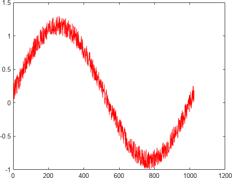{width="4.947916666666667in" height="3.8020833333333335in"}

#### 生成 MEX 函数用于测试

使用 **codegen** 命令生成 MEX 函数。**codegen** 命令会检查 MATLAB 函数是否适用于代码生成，并生成 MEX 函数，您可以在生成 C 代码之前在 MATLAB 中测试该函数。

>> **codegen averaging_filter -args {x} Code generation successful.**
>>

由于 C 使用静态类型，**codegen** 必须在编译时确定 MATLAB 文件中所有变量的属性。在这里，**-args** 命令行选项会提供一个示例输入，以便 **codegen** 基于输入类型推断新类型。使用上述步骤中创建的样本信号作为示例输入可确保 MEX 函数使用相同的输入。

默认情况下，**codegen** 在当前文件夹中生成名为 **averaging_filter_mex** 的 MEX 函数。这允许您测试 MATLAB 代码和 MEX 函数，并将结果进行比较。

#### 在 MATLAB 中测试 MEX 函数

在 MATLAB 中运行 MEX 函数

>> **y = averaging_filter_mex(x);**
>>

>> **% Plot the result when the MEX function is applied to the noisy sine wave.**
>>

>> **% The \'hold on\' command ensures that the plot uses the same figure window as**
>>

>> **% the previous plot command.**
>>

>> **hold on; plot(y, \'blue\');**
>>

{width="4.947916666666667in" height="3.8020833333333335in"}

#### 生成 C 代码

>> **codegen -config coder.config(\'lib\') averaging_filter -args {x} Code generation successful.**
>>

#### 检查生成的代码

带 **-config coder.config(\'lib\')** 选项的 **codegen** 命令可生成打包为独立 C 库的 C 代码。生成的 C 代码位于 **codegen/lib/averaging_filter/** 文件夹中。这些文件是：

>> **dir codegen/lib/averaging_filter/**
>>

>> **. .. \_clang-format averaging_filter.a averaging_filter.c ave**
>>

#### 检查 averaging_filter.c 函数的 C 代码

>> **type codegen/lib/averaging_filter/averaging_filter.c**
>>

>> **/\***
>>

- **Prerelease License - for engineering feedback and testing purposes**
- **only. Not for sale.**
- **File: averaging_filter.c**
-
- **MATLAB Coder version : 5.6**
- **C/C++ source code generated on : 30-Jan-2023 12:48:14**

>> **\*/**
>>

>> **/\* Include Files \*/**
>>

>> **#include \"averaging_filter.h\" #include \"averaging_filter_data.h\"**
>>

>> **#include \"averaging_filter_initialize.h\" #include \<string.h\>**
>>

>> **/\* Variable Definitions \*/ static double buffer\[16\];**
>>

>> **/\* Function Definitions \*/**
>>

>> **/\***
>>

- **Use a persistent variable \'buffer\' that represents a sliding window of**
- **16 samples at a time.**
-
- **Arguments : const double x\[1024\]**
- **double y\[1024\]**
- **Return Type : void**

>> **\*/**
>>

>> **void averaging_filter(const double x\[1024\], double y\[1024\])**
>>

>> **{**
>>

>> **double dv\[15\]; int i;**
>>

>> **int k;**
>>

>> **if (!isInitialized_averaging_filter) { averaging_filter_initialize();**
>>

>> **}**
>>

>> **/\* y = averaging_filter(x) \*/**
>>

>> **/\* Take an input vector signal \'x\' and produce an output vector signal \'y\'**
>>

>> **\* with \*/**
>>

>> **/\* same type and shape as \'x\' but filtered. \*/ for (i = 0; i \< 1024; i++) {**
>>

>> **double b_y;**
>>

>> **/\* Scroll the buffer \*/**
>>

>> **memcpy(&dv\[0\], &buffer\[0\], 15U \* sizeof(double));**
>>

>> **/\* Add a new sample value to the buffer \*/ b_y = x\[i\];**
>>

>> **buffer\[0\] = b_y;**
>>

>> **/\* Compute the current average value of the window and \*/**
>>

>> **/\* write result \*/**
>>

>> **for (k = 0; k \< 15; k++) { double d;**
>>

>> **d = dv\[k\]; buffer\[k + 1\] = d; b_y += d;**
>>

>> **}**
>>

>> **y\[i\] = b_y / 16.0;**
>>

>> **}**
>>

>> **}**
>>

>> **/\***
>>

- **Use a persistent variable \'buffer\' that represents a sliding window of**
- **16 samples at a time.**
-
- **Arguments : void**
- **Return Type : void**

>> **\*/**
>>

>> **void averaging_filter_init(void)**
>>

>> **{**
>>

>> **memset(&buffer\[0\], 0, 16U \* sizeof(double));**
>>

>> **}**
>>

>> **/\***
>>

- **File trailer for averaging_filter.c**
-
- **\[EOF\]**

>> **\*/**
>>

## 代码生成指南：生成可部署的 C/C++ 代码

可以使用 MATLAB Coder 为 MATLAB 代码生成 C/C++ 代码。您可以：

- 生成独立 C/C++ 代码以作为源代码、静态库或动态库在工程中使用。
- 生成 MEX 代码以加速计算密集型操作。

按照本指南中的任务进行操作，学习独立代码生成及其部署。

1. 准备您的 MATLAB 代码以进行代码生成。
2. 从您的 MATLAB 代码生成 C/C++ 代码。
3. 测试生成的 C/C++ 代码。
4. 将生成的代码部署到现有工程中。

要确定完成代码生成过程所需的任务，请使用此工作流程图。

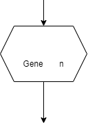

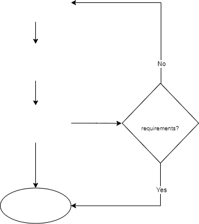

要开始本教程，请参阅"准备 [MATLAB 代码以进行代码生成" （第 2-40](#%E5%87%86%E5%A4%87-matlab-%E4%BB%A3%E7%A0%81%E4%BB%A5%E8%BF%9B%E8%A1%8C%E4%BB%A3%E7%A0%81%E7%94%9F%E6%88%90) 页）。

### 另请参阅相关示例

- ["准备 MATLAB 代码以进行代码生成" （第 2-40 页）](#%E5%87%86%E5%A4%87-matlab-%E4%BB%A3%E7%A0%81%E4%BB%A5%E8%BF%9B%E8%A1%8C%E4%BB%A3%E7%A0%81%E7%94%9F%E6%88%90)
- ["指定输入类型" （第 2-42 页）](#%E6%8C%87%E5%AE%9A%E8%BE%93%E5%85%A5%E7%B1%BB%E5%9E%8B)
- ["配置代码生成编译设置" （第 2-42 页）](#%E9%85%8D%E7%BD%AE%E4%BB%A3%E7%A0%81%E7%94%9F%E6%88%90%E7%BC%96%E8%AF%91%E8%AE%BE%E7%BD%AE)
- ["测试生成的 C/C++ 代码" （第 2-46 页）](#%E6%B5%8B%E8%AF%95%E7%94%9F%E6%88%90%E7%9A%84-cc-%E4%BB%A3%E7%A0%81)
- ["部署生成的 C/C++ 代码" （第 2-48 页）](#%E9%83%A8%E7%BD%B2%E7%94%9F%E6%88%90%E7%9A%84-cc-%E4%BB%A3%E7%A0%81)

## 准备 MATLAB 代码以进行代码生成

为了生成 C/C++ 代码，代码生成器将动态定型的 MATLAB 代码转换为静态定型的 C/C++。动态类型的 MATLAB 变量可以在运行时更改其属性。可以使用同一变量来存储任何类、大小或复/实性的值。C/C++ 等静态类型的语言必须在编译时确定变量类型。

在生成代码之前，确定要为哪个函数生成代码。此函数称为入口函数或主函数。要准备您的代码以进行代码生成，请执行下列步骤：

1. 初始化变量以进行代码生成。
2. 筛查包含不支持的函数和语言功能的代码。

### 初始化变量以进行代码生成

由于生成的代码是静态定型的，请在使用之前初始化代码中的所有变量，以允许代码生成器在生成代码中正确地识别和分配变量。要识别其中一些问题，请在代码中包含以下行。

>> **%#codegen**
>>

下表列出了在用于代码生成的代码中初始化变量时可能出现的一些常见错误。

+---------------------------------------+----------------------------------------------------+----------------------------------------------+
| >> **原始代码**                        | >> **问题**                                         | **修改后的代码**                             |
+=======================================+====================================================+==============================================+
| >> **y = zeros(1,10); y(3) = 1 + 2i;** | >> **y** 定义为双精度类型，但被赋予了复数双精度值。 | **y = complex(zeros(1,10)); y(3) = 1 + 2i;** |
+---------------------------------------+----------------------------------------------------+----------------------------------------------+
| >> **for i = 1:N y(i,i) = i;**         | > 数组 **y** 在未定义的情况下进行了动态扩展。      | **y = zeros(N,N); for i = 1:N**              |
| >                                     |                                                    |                                              |
| >> **end**                             |                                                    | **y(i,i) = i; end**                          |
+---------------------------------------+----------------------------------------------------+----------------------------------------------+

有关特定数据类型的代码生成的数据定义的信息，请参阅"代码生成的数据定义注意事项"和"为 C/C++ 代码生成定义变量的最佳做法"。

### 筛查包含不支持的函数和语言功能的代码

代码生成器支持大多数语言功能和函数。要检查代码中是否包含不支持的函数和语言功能，请执行下列步骤：

1. 从 **App** 选项卡启动 MATLAB Coder。或者，在命令行中键入以下内容：

>> **\>\> coder**
>>

2. 在 App 中输入入口函数名称。不要在此步骤中添加子函数。代码生成器会自动包含所有必需的子函数。
3. 要获得代码生成就绪工具报告，请点击**下一步**。如果您的代码中包含不支持的函数或语言功能，将会在此处报告。

或者，对您的入口函数调用 screener。在命令行中，运行以下命令：

>> **coder.screener(\'filename\');**
>>

此工具会解析您的代码，并突出显示不支持的 MATLAB 函数和一些不支持的语言功能。请参阅 "C/C++ 代码生成支持的函数和对象"和 **coder.screener**。

如果您的代码包含不支持的函数，请考虑以下解决方法：

- 检查是否存在支持代码生成的替换函数和 System object。
- 为这些函数编写自定义代码。

使用 **coder.ceval** 调用针对该函数的自定义 C 函数。

- 使用 **coder.extrinsic** 调用该函数。

### 提示

#### 在命令行中设置高级代码生成选项

对配置对象 **coder.config** 使用 **codegen** 函数。根据编译的类型，您还可以使用 **coder.CodeConfig**、 **coder.EmbeddedCodeConfig** 和 **coder.MexCodeConfig**。

#### 研究特定函数的代码生成注意事项

代码生成支持的函数的参考页包含标题为扩展功能的部分。本节列出了为这些函数生成代码时的所有特殊注意事项。有关示例，请参阅 **interp2** 中的扩展功能。

#### coder.extrinsic 调用

调用 **coder.extrinsic** 会将函数声明为外部函数。代码生成器不为外部函数体生成代码，而是使用 MATLAB➅ 引擎来执行调用。

### 另请参阅 {#另请参阅-4}

>> **coder.target** \| **coder.screener** \| **coder.ceval** \| **coder.extrinsic** \| **codegen** \| **coder.config** \|
>>

>> **coder.CodeConfig** \| **coder.EmbeddedCodeConfig** \| **coder.MexCodeConfig**
>>

### 相关示例

- "代码生成的数据定义注意事项"
- "为 C/C++ 代码生成定义变量的最佳做法"
- "支持 C/C++ 代码生成的 MATLAB 语言功能"
- "使用 MATLAB 引擎在生成的代码中执行函数调用"

## 从 MATLAB 代码生成 C/C++ 代码

在验证 MEX 代码行为后，为您的工程生成独立代码。

1. 指定输入类型。
2. 检查是否存在运行时问题。
3. 配置代码生成编译设置。
4. 生成独立的 C/C++ 代码。
5. 了解生成的代码。

### 指定输入类型

在生成代码之前，向代码生成器提供输入类型。然后，代码生成器确定要在生成的代码中使用的数据类型。

要自动定义输入类型，请使用示例输入调用您的函数，或在提示符下输入调用您的函数的脚本。通过提供示例输入来直接提供输入类型。如果您的代码需要大小为 **3**×**4** 的双精度矩阵，则示例输入可以是 **zeros(3,4)** 或 **ones(3,4)**。

有关详细信息，请参阅"代码生成的输入类型设定" [（第 1-11](#%E4%BB%A3%E7%A0%81%E7%94%9F%E6%88%90%E7%9A%84%E8%BE%93%E5%85%A5%E7%B1%BB%E5%9E%8B%E8%AE%BE%E5%AE%9A) 页）。

### 检查运行时问题

在为代码生成器定义输入类型后，需要执行初始代码生成和代码执行，以检测在生成代码中较难诊断的运行时错误。

1. 要为您的代码生成 MEX 文件，请点击**检查问题**按钮。
2. 您可以通过在**更多设置**下的**调试**部分中选择**始终创建代码生成报告**选项来自动打开代码生成报告。

请参阅"为什么要在 MATLAB 中测试 MEX 函数？"。

### 配置代码生成编译设置

要根据您的需求创建代码，您可以更改代码生成器的配置设置。在 App 的**生成代码**选项卡中，选择选项卡底部的**更多设置**按钮。此窗口列出用于修改生成代码的配置设置。

使用这些设置可以指定生成代码的编译位置，应用特定于目标的优化，启用可变大小支持，在生成代码中包括注释，以及为生成代码应用其他自定义设置。

### 生成独立的 C/C++ 代码

在通过生成 MEX 文件检查运行时问题后，通过在 App 的**生成代码**选项卡下选择所需的**编译类型**来生成独立的 C/C++ 代码。

要为您的工程生成代码，请点击**生成**。

### 了解生成的代码

#### 访问代码生成报告

使用代码生成报告查看生成的 C/C++ 代码，在 MATLAB 代码和生成的 C/C++ 代码之间追溯，并识别生成的代码中的潜在问题。

在生成代码后，要打开代码生成报告，请执行以下操作。

- 在 MATLAB Coder 的**调试**设置中，选中**始终创建报告**和**生成报告后自动启动报告**复选框。有关详细信息，请参阅"Code Generation Reports"。

#### 生成的代码中的数组布局

编程语言和环境通常为所有数据假设单一的数组布局。MATLAB 默认使用列优先布局，而 C 和 C++ 使用行优先布局。

要生成行优先代码，请执行以下操作：

1. 在 App 中，打开**生成**对话框。在**生成代码**页上，点击**生成**箭头。
2. 点击**更多设置**。
3. 在**内存**选项卡上，将**数组布局**设置为"行优先"。

请参阅"Code Design for Row-Major Array Layout"。

#### 生成的代码中的内存分配

对于代码生成，数组维度为固定大小或可变大小。如果代码生成器可以确定维度的大小并且维度的大小不会更改，则维度为固定大小。当数组的所有维度都是固定大小时，该数组是固定大小数组。

您可以生成在程序堆栈或堆上为固定大小和可变大小数组分配内存的代码。

静态内存分配在编译时为程序堆栈上的数组分配内存。在以下情况下，静态分配是有益的：

- 您知道所有正在使用的数组的上界。
- 您有很大的程序堆栈。
- 这些数组很小，在程序堆栈中占用的空间较少。

动态内存分配在运行时根据需要在堆上分配内存，而不是在堆栈上静态分配内存。在以下情况下，动态内存分配是有益的：

- 您不知道数组的上界。
- 您不想在堆栈上为大型数组分配内存。

动态内存分配会导致所生成代码的执行速度变慢。请参阅"Control Memory Allocation for Variable-

Size Arrays"。

要在生成的代码中为固定大小和可变大小数组动态分配内存，请执行以下操作：

1. 在 App 中，打开**生成**对话框。在**生成代码**页上，点击**生成**箭头。
2. 点击**更多设置**。
3. 在**内存**选项卡上，从下拉列表中为**可变大小数组的动态内存分配**选择值。
4. 在**内存**选项卡上，从下拉列表中为**固定大小数组的动态内存分配**选择值

将这些选项设置为 **\'Threshold\'** 会导致动态分配大小（以字节为单位）大于阈值的数组。

### 提示

#### 定义无界数组的最大大小

如果您正在为其大小取决于用户输入的数组生成代码，您仍可以通过使用 **assert** 函数来设置此类输入的上限。例如：

>> **function inSize(n) assert(n \< 25);**
>>

>> **y = zeros(1,n); end**
>>

当无法使用动态内存分配时，请定义数组的上界。

#### 文件 I/O 支持

代码生成器包括对 **coder.load**、**fread**、**fopen**、**fprintf** 和 **fclose** 等函数的有限支持。

#### 从 C 工程中调用生成的代码

代码生成器提供了一个示例主函数，供您在生成静态或动态库时参考。请参阅"在应用程序中使用示例 C 主函数"。

#### 在命令行中生成代码

您可以在命令行中生成代码并设置所有选项。请参阅 **codegen** 和 **coder.config**。

您也可以在命令行中使用代码配置对象设置这些选项。这些选项是配置对象的属性，可通过圆点表示法访问。请参阅 **coder.MexCodeConfig**、**coder.CodeConfig** 和 **coder.EmbeddedCodeConfig**。

[**注意** 要打开包含关联的编译配置设置的对话框，请双击工作区中的配置对象。]{.underline}

#### 将工程转换为脚本

您也可以使用 **coder** 命令的 **-tocode** 选项将工程转换为脚本。

#### 优化生成的代码

虽然代码生成器可以为大多数应用程序生成优化的代码，但您可以通过遵循以下一些最佳做法来为工程生成高效的 C/C++ 代码：

- 按引用传递参数
- 内联代码
- 集成优化的外部代码
- 禁用运行时检查

有关详细信息，请参阅"优化策略"。

#### 在命令行中创建报告

在命令行中生成代码时，请使用以下 **codegen** 选项：

- 要生成报告，请使用 **-report** 选项。
- 要生成并打开报告，请使用 **-launchreport** 选项。

或者，使用以下配置对象属性：

- 要生成报告，请将 **GenerateReport** 设置为 **true**。
- 如果您希望 **codegen** 命令为您打开报告，请将 **LaunchReport** 设置为 **true**。

### 另请参阅 {#另请参阅-5}

>> **coder.cstructname** \| **coder.MexCodeConfig** \| **coder.CodeConfig** \|
>>

>> **coder.EmbeddedCodeConfig** \| **coder.load** \| **fread** \| **fclose** \| **fprintf** \| **fopen** \| **coder.opaque**
>>

### 相关示例

- "Specify Objects as Inputs at the Command Line"
- "Code Design for Row-Major Array Layout"
- "Control Memory Allocation for Variable-Size Arrays"

## 测试生成的 C/C++ 代码

为您的 MATLAB 代码生成代码后，请验证生成代码的运行时行为。要查看生成的代码并识别潜在问题，请访问代码生成报告。

根据您的编译类型，您可以测试生成的代码以验证代码行为：

- 测试 MEX 代码以验证行为。
- 通过使用软件在环和处理器在环执行来测试独立代码（需要 Embedded Coder）。

### 测试 MEX 代码以验证行为

如果您使用 App 生成 MEX 函数，您可以在 App 中测试 MEX 函数。

1. 在**生成代码**页上，点击**验证代码**。
2. 键入或选择测试文件名。
3. 要运行测试文件而不将对原始 MATLAB 函数的调用替换为对 MEX 函数的调用，请选择 **MATLAB 代码**作为**运行方式**。点击**运行生成的代码**。
4. 要运行测试文件并将对原始 MATLAB 函数的调用替换为对 MEX 函数的调用，请选择**生成代码**作为**运行方式**。点击**运行生成的代码**。
5. 将运行原始 MATLAB 函数的结果与运行 MEX 函数的结果进行比较。

如果您有 Embedded Coder，您可以通过使用软件在环 (SIL) 或处理器在环 (PIL) 执行来验证生成的 C/C+

\+ 代码的数值行为。您还可以生成执行时间的概要文件。

### 通过使用软件在环和处理器在环测试独立代码

要在目标硬件上测试生成的独立代码，可以对生成的代码运行单元测试。要在 MATLAB 之外的单独进程中对独立代码运行单元测试，请使用软件在环 (SIL) 或处理器在环 (PIL) 执行。要使用 SIL 或 PIL 执行，您必须有 Embedded Coder。

请参阅"使用 MATLAB Coder 的软件在环执行" (Embedded Coder)和"Processor-in-the-Loop Execution with the MATLAB Coder App" (Embedded Coder)。

### 提示

#### 在命令行中测试 MEX 文件

如果使用 **codegen** 生成 MEX 函数，请使用 **-test** 选项。例如：

>> **codegen myfunction -test \'myfunction_test\'**
>>

您也可以使用 **coder.runTest** 来测试 MEX 函数。例如：

>> **coder.runTest(\'myfunction_test\', \'myfunction\')**
>>

#### 对生成的代码进行单元测试

请参阅"Unit Test Generated Code with MATLAB Coder"。

要对外部代码进行单元测试，请参阅"Unit Test External C Code with MATLAB Coder"。

### 另请参阅 {#另请参阅-6}

>> **coder.runTest**
>>

### 相关示例

- "Code Generation Reports"
- "使用 MATLAB Coder 的软件在环执行" (Embedded Coder)
- "Processor-in-the-Loop Execution with the MATLAB Coder App" (Embedded Coder)

## 部署生成的 C/C++ 代码

一旦验证了生成的代码能够满足您的需求，您就可以部署它。您可以将生成的代码部署为源代码、静态库、动态库或可执行的应用程序。

要打包在外部平台上编译应用程序所需的所有源文件，请使用 **packNGo** 函数。要使用代码生成器编译可执行的应用程序，您必须：

1. 生成所需的源代码或库（在前面的步骤中已完成）。
2. 创建一个调用生成代码的主函数。
3. 在编译类型设置为"可执行文件**(.exe)**" 的情况下迭代进行代码生成。

### 编辑生成的主函数和接口

要创建应用程序，请创建或使用 C/C++ 主函数来调用从 MATLAB 函数生成的 C/C++ 入口函数。例如，请参阅"从 MATLAB 代码生成独立的 C/C++ 可执行文件"。

>> **注意** 不要修改 **examples** 子文件夹中的 **main.c** 和 **main.h** 文件。在使用示例主函数之前，将示例主函[数源文件和头文件复制到编译文件夹以外的某个位置。修改新位置的文件以满足您的应用程序的要求。]{.underline}
>>

使用生成的示例主函数作为创建主函数的起点。示例主函数清晰地展示了如何向生成的代码传递输入和从生成的代码传递输出。有关详细信息和示例，请参阅"使用示例主函数合并生成的代码"和"生成的示例 C/C++ 主函数的结构"。

#### 生成的函数接口

要编写主函数，您必须熟悉生成的函数接口。请参阅"Mapping MATLAB Types to Types in Generated Code"。

C/C++ 入口函数遵循以下约定：

- 按引用传递输入数组。
- 按引用返回输出数组。
- 按值传递输入标量。
- 对单输出函数按值返回标量。
- 按引用返回标量：

  - 适用于具有多个输出的函数。
  - 适用于使用相同的变量作为输入和输出的情况。

如果在 MATLAB 代码中使用相同的变量作为输入和输出，生成的代码将按引用传递标量。请参阅"Avoid Data Copies of Function Inputs in Generated Code"。

#### 数组定义

代码生成器创建依赖数组元素类型及其内存分配类型的 C/C++ 数组定义。请参阅"Representation of Arrays in Generated Code"。

要了解与生成代码中的数组相关联的方法的更多信息，请参阅：

- "在生成的函数接口中使用 C 数组"
- "Use Dynamically Allocated C++ Arrays in Generated Function Interfaces"

#### 初始化函数和终止函数

除了 C/C++ 入口函数之外，C/C++ 代码还必须调用生成的初始化函数和终止函数。默认情况下，生成的 C/C++ 入口函数调用初始化函数。生成的示例主函数调用终止函数。当您创建和编辑自己的主函数时，请确保同时调用初始化函数和终止函数。

有关详细信息，请参阅"Use Generated Initialize and Terminate Functions"。

### 使用 MATLAB Coder 编译可执行应用程序

创建主文件 (**main.c**) 和主函数头文件 (**main.h**) 后，请按照以下步骤使用该 App 编译可执行应用程序：

1. 在 App 中打开**生成代码**页。
2. 将**编译类型**设置为"可执行文件**(.exe)**"。
3. 点击**更多设置**。
4. 在**自定义代码**选项卡的**其他源文件**中，输入 **main.c**
5. 在**自定义代码**选项卡的**其他包括目录**中，输入修改后的 **main.c** 和 **main.h** 文件的位置。例如，

>> **c:\\myfiles**。点击**关闭**。
>>

6. 要生成可执行文件，请点击**生成**。

App 指示代码生成成功。

7. 点击**下一步**以转至**完成工作流**步骤。
8. 在**生成的输出**下，您可以看到生成的可执行文件 **filename.exe** 的位置。

在生成代码并编写使用生成代码的主文件后，您可以使用代码生成器或其他编译工具生成可执行应用程序。如果您要将生成的代码以可导出的 zip 文件形式传输到目标平台，请使用 **packNGo** 函数。

### 目标特定代码生成

要将您的代码部署到另一个平台，请使用支持为该平台生成和编译二进制代码的硬件支持包。在 MATLAB Coder 中，在**生成代码**步骤中，从**硬件板**下拉列表中选择一个硬件支持包。

有关为 MATLAB Coder 提供的支持包列表，请参阅 "MATLAB Coder 支持的硬件"。如果要为硬件支持包中不可用的编译指定自定义工具链，您可以注册自己的工具链。请参阅"自定义工具链注册"。

### 提示

#### 在命令行中选择硬件

在命令行中，使用 **coder.hardware** 函数指定硬件支持包。

#### 在 MATLAB 中运行可执行文件

要在 Windows➅ 平台上的 MATLAB 中运行可执行文件，请执行以下命令：

>> **system(\'filename.exe\')**
>>

### 另请参阅 {#另请参阅-7}

>> **coder.hardware** \| **packNGo**
>>

### 相关示例

- "Deploy Generated Code"
- "从 MATLAB 代码生成独立的 C/C++ 可执行文件"
- "使用示例主函数合并生成的代码"
- "生成的示例 C/C++ 主函数的结构"
- "Mapping MATLAB Types to Types in Generated Code"
- "Avoid Data Copies of Function Inputs in Generated Code"
- "Representation of Arrays in Generated Code"
- "在生成的函数接口中使用 C 数组"
- "Use Dynamically Allocated C++ Arrays in Generated Function Interfaces"
- "MATLAB Coder 支持的硬件"
- "自定义工具链注册"

# 使用 MATLAB Coder 的最佳做法

- ["推荐的 codegen 编译选项" （第 3-2 页）](#%E6%8E%A8%E8%8D%90%E7%9A%84-codegen-%E7%BC%96%E8%AF%91%E9%80%89%E9%A1%B9)
- ["在 MATLAB 中测试 MEX 函数" （第 3-3 页）](#%E5%9C%A8-matlab-%E4%B8%AD%E6%B5%8B%E8%AF%95-mex-%E5%87%BD%E6%95%B0-1)
- ["使用 MATLAB 编辑器中的平铺功能比较 C 代码和 MATLAB 代码" （第 3-4 页）](#%E4%BD%BF%E7%94%A8-matlab-%E7%BC%96%E8%BE%91%E5%99%A8%E4%B8%AD%E7%9A%84%E5%B9%B3%E9%93%BA%E5%8A%9F%E8%83%BD%E6%AF%94%E8%BE%83-c-%E4%BB%A3%E7%A0%81%E5%92%8C-matlab-%E4%BB%A3%E7%A0%81)
- ["使用编译脚本" （第 3-5 页）](#%E4%BD%BF%E7%94%A8%E7%BC%96%E8%AF%91%E8%84%9A%E6%9C%AC)
- ["使用 MATLAB 代码分析器检查代码" （第 3-6 页）](#%E4%BD%BF%E7%94%A8-matlab-%E4%BB%A3%E7%A0%81%E5%88%86%E6%9E%90%E5%99%A8%E6%A3%80%E6%9F%A5%E4%BB%A3%E7%A0%81)
- ["将测试平台与函数代码分离" （第 3-7 页）](#%E5%B0%86%E6%B5%8B%E8%AF%95%E5%B9%B3%E5%8F%B0%E4%B8%8E%E5%87%BD%E6%95%B0%E4%BB%A3%E7%A0%81%E5%88%86%E7%A6%BB)
- ["保留您的代码" （第 3-8 页）](#%E4%BF%9D%E7%95%99%E6%82%A8%E7%9A%84%E4%BB%A3%E7%A0%81)
- ["文件命名约定" （第 3-9 页）](#%E6%96%87%E4%BB%B6%E5%91%BD%E5%90%8D%E7%BA%A6%E5%AE%9A)

## 推荐的 codegen 编译选项

### -c 只生成代码

使用 **-c** 选项可只生成代码，而不调用 **make** 命令。如果使用此选项，则 **codegen** 不会生成编译的目标代码。在开发周期内，当您需要在修改 MATLAB 代码和生成 C 代码之间快速迭代，并且主要是检查 C 代码时，此选项可节省时间。

有关详细信息和编译选项的完整列表，请参阅 **codegen**。

### -report 生成代码生成报告

使用 **-report** 选项可在编译时生成 HTML 格式的代码生成报告，以帮助您调试 MATLAB 代码，并验证它是否适用于代码生成。如果未指定 **-report** 选项，**codegen** 仅在出现编译错误或警告时，才会生成报

告。

代码生成报告包含以下信息：

- 编译结果的摘要，包括目标类型和警告或错误数量
- 记录编译和链接活动的编译日志
- 指向生成的文件的链接
- 错误和警告消息

有关详细信息，请参阅 **codegen**。

## 在 MATLAB 中测试 MEX 函数

要在生成 C 代码之前准备您的 MATLAB 代码，请使用 **codegen** 将您的 MATLAB 代码转换为 MEX 函数。**codegen** 会生成特定于平台的 MEX 文件，您可以在 MATLAB 环境中执行该文件，以测试您的算法。

有关详细信息，请参阅 **codegen**。

## 使用 MATLAB 编辑器中的平铺功能比较 C 代码和 MATLAB 代码

使用 MATLAB 编辑器中的左/右平铺功能比较生成的 C 代码与原始 MATLAB 代码。您可以轻松地将生成的 C 代码与您的原始 MATLAB 代码进行比较。在生成的 C 代码中：

- 您的函数名称保持不变。
- 您的注释保留在相同的位置。

要比较两个文件，请执行下列步骤：

>> **1** 在编辑器中打开 C 文件和 MATLAB 文件。（如果两个窗口未停靠，则将其停靠。）
>>

{width="0.2604166666666667in" height="0.2604166666666667in"}**2**

选择 **Window** \>> **Left/Right Tile**（或 工具栏按钮）可并排查看文件。

下图显示了 MATLAB 文件 **kalman02.m** 及其生成的 C 代码 **kalman02.c**。

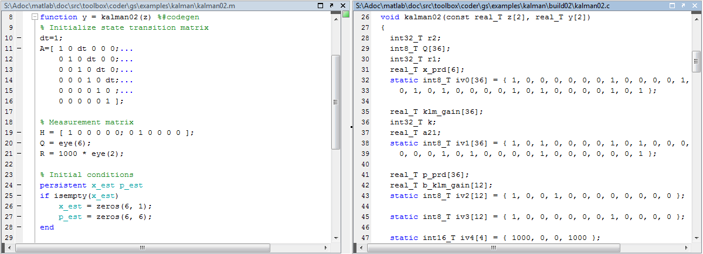{width="6.869270559930008in" height="2.4921872265966756in"}

## 使用编译脚本

如果您使用 **codegen** 从命令行生成代码，请使用编译脚本调用 **codegen** 以便从您的 MATLAB 函数生成 MEX 函数。

编译脚本自动执行您希望从命令行重复执行的一系列 MATLAB 命令，为您节省时间和消除输入错误。例如，您可以在每次编译之前，使用编译脚本清空工作区并指定代码生成选项。

下面是运行 **codegen** 以处理 **lms_02.m:** 的示例编译脚本。

>> **close all; clear all; clc;**
>>

>> **N = 73113;**
>>

>> **codegen -report lms_02.m \...**
>>

>> **-args { zeros(N,1) zeros(N,1) }**
>>

其中：

- **close all** 删除其句柄未隐藏的图窗。有关详细信息，请参阅 MATLAB 图形函数参考中的 **close**。
- **clear all** 从内存中删除变量、函数和 MEX 文件，将工作区保留为空。它还会清除断点。

[**注意** 如果您想保留断点以用于调试，请删除编译脚本中的 **clear all** 命令。]{.underline}

- **clc** 从命令行窗口显示中清除所有输入和输出，创造一个"干净的屏幕"。
- **N = 73113** 设置变量 **N** 的值，它表示函数 **lms_02** 的两个输入参数中各自的样本数。
- **codegen -report lms_02.m -args { zeros(N,1) zeros(N,1) }** 调用 **codegen**，使用以下选项生成文件 **lms_02.m** 的 C 代码：

  - **-report** 生成代码生成报告
  - **-args { zeros(N,1) zeros(N,1) }** 将函数输入的属性指定为示例值元胞数组。在这种情况下，输入参数为双精度实数值的 N×1 向量。

## 使用 MATLAB 代码分析器检查代码

代码分析器会检查您代码的问题，并提出修改建议。您可以在工作时，在 MATLAB 编辑器中使用代码分析器以交互方式检查您的代码。

要确认已启用持续代码检查：

1. 在 MATLAB 中，选择 **Home** 选项卡，然后点击 **Preferences**。
2. 在 **Preferences** 对话框中，选择 **Code Analyzer**。
3. 在 **Code Analyzer Preferences** 窗格中，确认已选择 **Enable integrated warning and error messages**。

## 将测试平台与函数代码分离

如果您使用 **codegen** 从命令行生成代码，应将您的核心算法与测试平台分离。创建单独的测试脚本，以执行预处理和后处理，例如加载输入、设置输入值、调用受测函数以及输出测试结果。

## 保留您的代码

在进行进一步修改之前保留您的代码。这种做法可在出现错误时提供一条退路，并可提供测试和验证的基线。使用一致的文件命名约定。例如，向序列中每个文件的文件名添加一个两位数后缀。有关详细信息，请参阅"文件命名约定" [（第 3-9](#%E6%96%87%E4%BB%B6%E5%91%BD%E5%90%8D%E7%BA%A6%E5%AE%9A) 页）。

## 文件命名约定

使用一致的文件命名约定标识不同类型和版本的 MATLAB 文件。此方法可保持您的文件井然有序，并将覆盖现有文件或在不同文件夹中创建两个同名文件的风险降至最低。

例如，《生成 MEX 函数》快速入门教程中的文件命名约定是：

- 后缀 **\_build** 标识编译脚本。
- 后缀 **\_test** 标识测试脚本。
- 数值后缀（例如 **\_01**）标识文件版本。这些数字通常是两位数连续整数，从 01、02、03 等开始。

例如：

- 文件 **build_01.m** 是本教程的编译脚本的第一个版本。
- 文件 **test_03.m** 是本教程的编译脚本的第三个版本。
